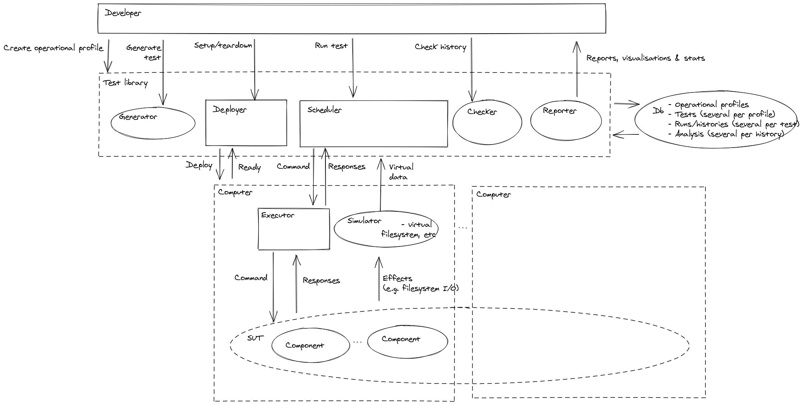

## detsys-testkit

System tests are usually slow, non-deterministic and should therefor be used
sparsely -- this project tries to turn this idea on its head.

By abstracting out the non-deterministic parts of the programs we write, e.g.
concurrency, and putting them behind interfaces we can then implement these
interfaces twice:

1. using the non-deterministic primitives, e.g. send and receive over the
   network, this gives you back the original program which you had before
   introducing the abstraction;
2. using functions that deterministically manipulate a pure data-structure, e.g.
   queues representing incoming network messages, this gives you a *simulation*
   of what your original program will do once you use the non-deterministic
   interface.

This simulation forms the basis for our system tests. The two key aspects of
this simulation is that it's deterministic (that doesn't mean there's no
randomness) and that we can control the passage of time (which in turn means we
don't have to wait for timeouts etc), which means we can get fast and
deterministic tests.

*Warning:* This is not a black-box testing approach, and unless your system
already hides all non-determinism behind interfaces then it's likely that your
system will need a substantial rewrite, which is probably not worth it unless
your system is a distributed system that hasn't already been battle-tested.

For more about simulation testing see [this](doc/simulation_testing.md)
document.

### Getting started

There are many parts that needs to be understood before we can explain how
simulation testing works in detail. It's perhaps easier to start with a concrete
example. The following steps gets you started using some of the tools on a
simple distributed register example:

0. Install [`nix`](https://nixos.org/download.html#nix-quick-install);
1. Clone this repository;
2. `cd` into the repository;
3. Issue `nix-build` to compile all binaries;
4. Run `nix-env -if default.nix` to package up and install all binaries;
5. Prepare the database with `detsys db up`;
6. Start the scheduler component with `detsys scheduler up`.

We are now ready to start testing.

In case you don't have a system of your own to test, which is very likely if you
are just getting started, you can try it out on one of the examples provided in
this repository using the instructions below:

7. Change directory to where the distributed register example lives with `cd
   src/sut/register`;
8. Run the first test from the test-suite by typing `go test -tags json1 -run 1`;
9. Notice how test id `0` and run id `3` doesn't pass the analysis. To debug
   that run enter `detsys debug 0 3`;
10. Navigate up and down through the messages with your arrow keys or `j` and
   `k`, and finally exit the debugger with `q` or `Ctrl-c`.

At this point it might make sense to have a look at the `go` test-suite in
[`example_test.go`](src/sut/register/example_test.go) and the actual
implementation of the distributed register. The implementation consists of two
parts: a front-end (see [`frontend1.go`](src/sut/register/frontend1.go)) which
receives client requests and propagates them to two distributed registers
([`register.go`](src/sut/register/register.go)). The client can be request a
write to or a read from the registers, and the idea with there being two
registers is that there is some form of redundancy. The implementation is flawed
however, as you might have been able to guess from the fact that the test fails.
Can you figure out what exactly the implementation does and why it's wrong by
using the debugger alone? For further refinements of the implementation see
[`frontend{2,3,4}.go`](src/sut/register) and see if you can figure out why they
do or don't work as well.

More about `nix` can be found [here](doc/nix.md), including a recommended
developer workflow and why it's preferable to `docker`.

### How it works on a higher-level

Now that we looked at a concrete example we are in better position to explain
the high-level picture of what is going on.

Testing, in general, can be split up into different stages. First we write or
generate a test case, then we execute that test case, afterwards we check that
outcome of the execution matches our expectations, and finally we might want to
aggregate some statistics about some subset of all tests that we have done for
further analysis.

When testing concurrent programs or distributed systems there are typically many
ways to execute a single test case. These different executions is the
non-determinism typically associated with concurrent or distributed systems. For
example, consider when two concurrent requests are being made against some
service then we typically cannot know which finishes first.

If we want our tests to be deterministic we need to be able to control the
scheduling of threads, or in the distributed systems case the scheduling of when
messages between the nodes of the system arrive at their destination.

Distributed systems typically consist of several different components that are
not necessarily written in the same programming language. Distributed systems
need to be resilient in the presence of failures. Distributed systems are also
long running, and as they run they might accumulate "junk" which makes them fail
over time. Distributed systems need to be able to be upgraded without downtime,
in order to do so they need to allow for different software versions of the
components to be compatible.

With all these constraints in mind, let us sketch the high-level design of this
project.

In order to be able to test how a system performs over time, we must be able to
test over time. That is: simulate a weeks worth of traffic today, make sure
everything looks fine, close everything down, and then the day after be able to
pick up where we left off and continue simulating another weeks worth of traffic
and so on. This type of workflow is also useful for when you need to explore a
huge state space but with limited resources, e.g. nightly CI runs, where you
want to avoid retesting the same thing. To facilitate the bookkeeping necessary
to do so we introduce a database for the testing work.

The different stages of testing, e.g. generating, executing, checking, etc,
become separate processes which can be run independently and they communicate
via the database. This allows for things like generating one test case,
executing it several times (especially important for concurrent or distributed
systems), check each execution several times all at different moments of time
(as we learn new things to assert we can check old execution traces without
rerunning the test).

In order to avoid the non-determinism of distributed systems we assume that all
components that rely on network communication implement a reactor-like
interface.

This interface abstracts out the concurrency from the implementation of the
system under test (SUT) and lets us create fake communication channels between
the nodes of the system. In fact we route all network messages through a
`scheduler` which assigns arrival times to all messages and there by controls in
which order messages arrive, hence eliminating the non-determinism related to
networking in a distributed system.

Another big source of non-determinism in distributed systems are faults.
Messages might arrive late, not arrive at all, or nodes might crash, etc. The
fault-space grows very [quickly](src/ldfi/README.md), so in order to achieve any
meaningful coverage we use [lineage-driven fault
injection](https://dl.acm.org/doi/10.1145/2723372.2723711). In short what it
does is to start with a successful test execution and tries to figure out what
steps in the execution were crucial to the outcome and bases the fault injection
on that analysis.

Because the SUT can be implemented in multiple different languages, there's a
small shim on top of the SUT, called `executor`, which receives messages from
the scheduler and applies them to the SUT. The idea being that this shim can
easily be ported to other programming languages.

One consequence of taming the non-determinism is that if we find a problem in
our SUT, then we can examine the execution in detail using a time-traveling
`debugger` which allows us to step forwards and backwards.

Here's a high-level diagram of the project:

As you can see, the developer can generate test cases, execute them, check their
traces all in separate steps by calling the test library. Typically this is done
from the test-suite of the software under test (SUT), however there's also a
command-line [tool](src/cli) which exposes much of the test library together
with some other conveniences such as migrating the database, starting the
scheduler and opening the debugger, as we saw in the getting started section
above, which you typically only want to do once and therefore outside of the
SUT's test-suite.

### More examples

* Reliable broadcast [example](src/sut/broadcast) from the *Lineage-driven fault
  injection* [paper](https://dl.acm.org/doi/10.1145/2723372.2723711) (2015) by
  Peter Alvaro et al.

### How it works on a lower-level

For the typical user it should be enough to understand the high-level picture,
the examples and the library API for the programming language they want to write
the tests in (currently only Golang is [supported](src/lib)).

However if you are curious or want to contribute to the project itself it's also
helpful to understand more about the components themselves and that's what this
section is about.

Let's start by introducing all components:

* `checker`: checks if a test case execution adhears to a given black-box
             specification, uses Jepsen's Elle transactional consistency checker;

* `cli`: discoverable and unifying interface between the developer and rest of
         the components;

* `db`: takes care of migrations for the sqlite database, typically only needed
  once. The schema has one table which provides is a simple append-only event
  store of json events, and a bunch of SQL `VIEW`s which are aggregated from the
  event store;

* `debugger`: visual aid for figuring out what happened during a test case execution;

* `executor`: programming language specific shim on top of the software under
                test (SUT) for converting programming language agnositic messages
                from the scheduler to the SUT;

* `generator`: tool for generating test cases (currently merely a placeholder,
                 not suitable for use);

* `ldfi`: suggests faults to inject given past test case executions;

* `lib`: a Golang library which provides the reactor-like
         [interface](doc/network_normal_form.md) and exposes all components, so they can
         be easily called from a test-suite (or from the command-line via `cli`);

* `logger`: Batches writes to the db, for better performance;

* `ltl`: checks if a test case execution adhears to a given white-box
          specification, uses linear temporal logic for concise assertions about
          the global state of all nodes in a SUT;

* `scheduler`: loads a generated test case and executes the test case by
                 forwarding the messages involved in the test case to the
                 appropriate executors one at the time. The new messages that
                 the executor gets back from the SUT when processing the
                 forwarded message gets sent back to the scheduler which
                 randomly, but deterministically using a seed, assigns arrival
                 times for the new messages, which simulates concurrency, and
                 then the process continues until there are no messages left or
                 some max execution time has been reached. See the following
                 [document](doc/pseudo_code_for_discrete-event_simulator.md) for
                 pseudo code of the scheduler implementation;

* `sut/register`: example test-suite for a simple distributed register;

* `sut/broadcast`: example test-suite for a simple broadcast protocol, taken
                      from the lineage-driven fault injection paper.

Because everything is deterministic, there are a few parameters which uniquely
determine the outcome of a test run. They are:

  * the test case;
  * the git commit hashes of the SUT and all above components;
  * the scheduler seed;
  * the faults that get injected.

A single test case might be executed using different (but compatible) versions
(git commits) of the SUT or project components, or using different scheduler
seed. Likewise a single test case exeuction might be analysed several times
using different checkers for example.

The database is basically organised to facilitate the above and enable as much
caching as possible. The components log everything that they are doing to the db
in a way that can be reproduced. In the future we hope to enable sharing of the
db between developers and CI, to avoid rerunning the same tests.

### How to contribute

Have a look at the [ROADMAP.md](ROADMAP.md) for a high-level overview of where
we are heading and see the file [CONTRIBUTING.md](CONTRIBUTING.md) for more
workflow related stuff.

### See also

* The [P](https://github.com/p-org/P) programming language;
* [Simulant](https://github.com/Datomic/simulant);
* [Jepsen](https://github.com/jepsen-io/jepsen) and
  [Maelstrom](https://github.com/jepsen-io/maelstrom);
* [stateright](https://github.com/stateright/stateright);
* [Spritely goblins](https://spritelyproject.org/#goblins);
* [seaslug](https://github.com/spacejam/seaslug).

### License

See the file [LICENSE](LICENSE).
