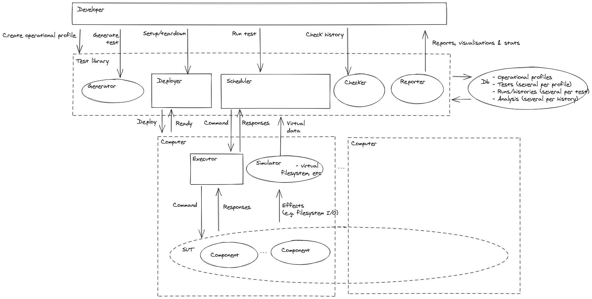
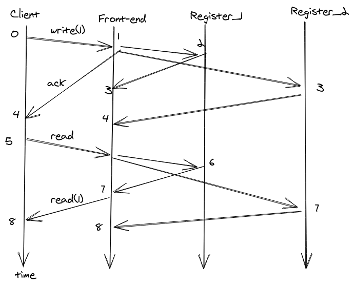
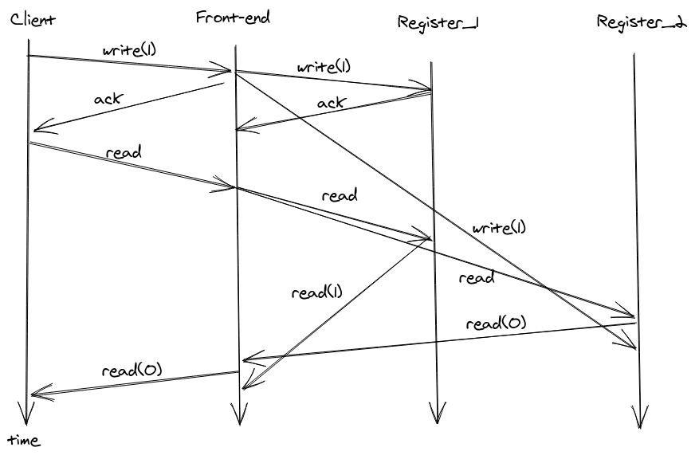
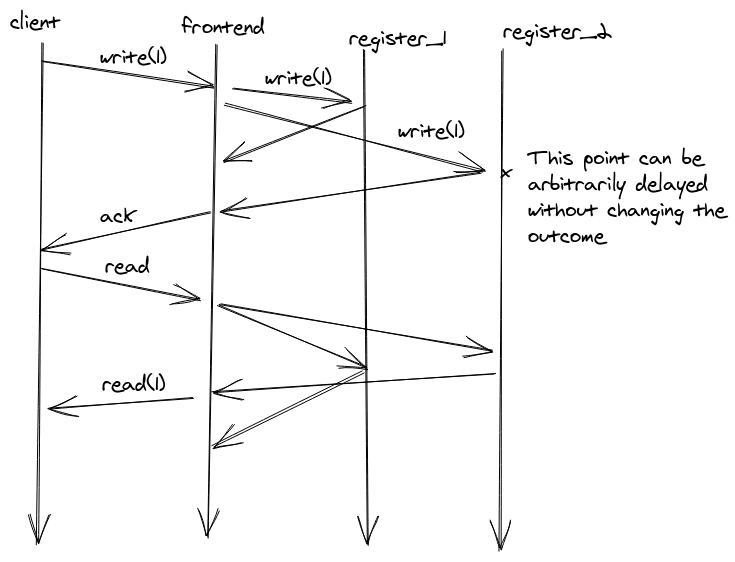
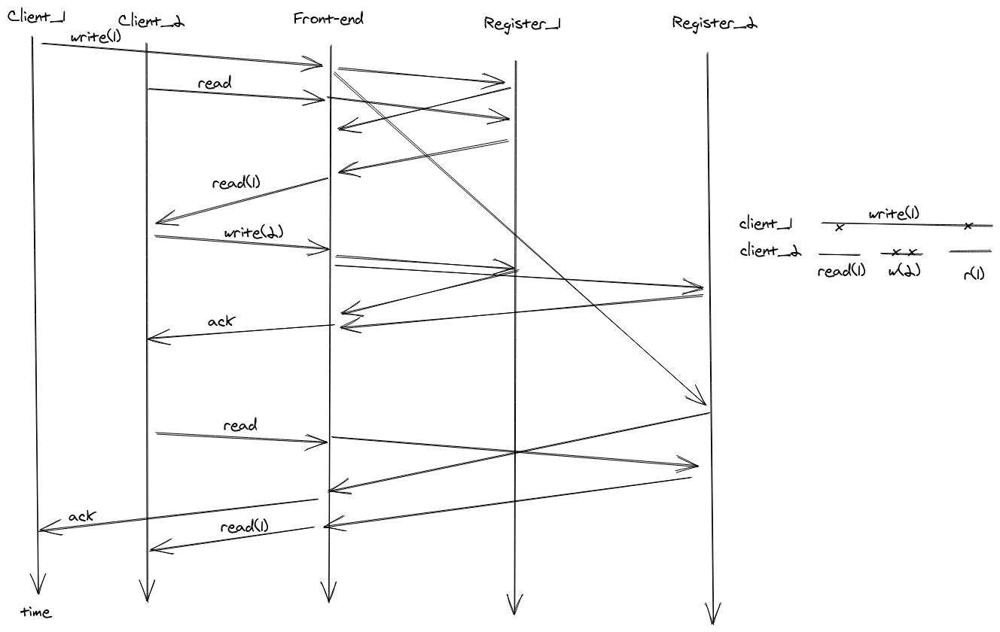

# Overview

* Explain the problem with current approaches to system tests;

* Give a high-level overview of test library we've started to develop that
  addresses said problems;

* Demo;

* More detailed explanation of how the test library works, in particular:
  - Elle checker;
  - Lineage-driven fault injection.

* Next steps and future work;

* Summary.

---

# The problem

System tests, in general, are:

* Non-deterministic and slow

  - Running the same test twice can yield different outcomes, esp. around
    fault-injection;

* Ill-specified or provide weak guarantees
  - What exactly have we shown if the tests pass?

* Ephemeral

  - Hard to test performance over time, i.e. test one month worth of traffic,
    check if everything is fine, then test another month's worth of traffic the
    day after;

  - Hard to test upgrades, or backup and restore from crashes, etc;

* Language specific

  - Test libraries/frameworks/tools are programming language specific, while the
    components of systems under test are written in different languages.

---

# Parts of the solution

* Generator: generates random test cases;
* Scheduler: deterministically controls the network traffic during the test;

* Executor: receives messages from the scheduler and executes them against the
  system under test (SUT);

* Ldfi: figures out which faults to inject;

* Checker: analyses the output of a test case execution and determines if it was
  a success or not.

---

{ width=110% }\

---

# Solution for non-determinism and speed

* SUT is assumed to be written on reactor form, i.e. given an incoming message
  and some internal state, update the state and produce a set of outgoing
  messages [@joe, p 87];

* All messages get set via the Scheduler which randomly, but deterministically
  using a seed, determines the arrival order of the messages;

* Timeouts and retires are handled by explicit tick messages, that are also
  deterministically sent by the Scheduler, which means we can speed up time and
  not have to wait for actual timeouts to happen.

---

# Language agnostic solution

* In between the SUT and the Scheduler sits the Executor, whose job is to
  receive messages from the Scheduler via an http interface and pass them on to
  the SUT;

* The Executor is written in the same language as the SUT, so once it got the
  message via http it decodes the message from JSON into a datastructure in the
  native language and does a simple function call to the the SUT;

* Porting an Executor to a new programming language is simple, which means it's
  easy to test systems written using many languages.

---

# Solution to ill-specified guarantees

* The Checker component uses Jepsen's state-of-the-art Elle checker, which
  provides precise models and guarantees;

* Lineage-driven fault injection is used to give guarantees in the presence
  faults;

* Operational profiles/usage models will later be used to drive test case
  generation, and guarantee system test coverage and reliability.

---

# Solution to long-lived testing

* Every interaction that the developer can do, e.g. generation, execution,
  checking, can be done in isolation because the input and output comes and goes
  via a database;

* The above in combination with determinism means that we can replay an old test
  and bring the system to the state it was in at the end of a test, we can then
  extend the test can carry on from there.

---

# Demo: the SUT

* The example SUT is a integer-valued shared/distributed register;

* Any number of clients can write or read an integer from the register;

* The register is replicated to try to achieve fault tolerance.

---

# Demo: shared register v1, success

\

---

# Demo: shared register v1, counterexample

\

---

# Demo: the testsuite of the SUT

* Show the code of `detsys/sut/register_test.go`;
* `go test`;
* Ensure that we find the problem.

---

# Demo: shared register v2, success

\

---

# Demo: shared register v2, counterexample

\

---

# How does the Elle checker work?

---

# How does lineage-driven fault injection work?

```

traces := []
faults := {}
result := ""

forever:
    inject(faults)
    success, trace := run(test)
    if !success:
        result := failure(faults)
        break
    traces.append(trace)
    faults := ldfi(traces)
    if faults is empty:
        result := "success"
        break
```

---

# How does lineage-driven fault injection work? \#2

```

fun ldfi(list of trace) -> set of fault

type trace =
  { message: Msg,
    from: Node,
    to: Node,
    at: Time }

type fault
  = omission { from: Node, to: Node, at: Time}
  | ...
```

---

# How does lineage-driven fault injection work? \#3

* `fun ldfi(traces: list of trace) -> set of fault`

* Each trace contains possible messages to drop,
  so create a big OR-formula like:

```
      omission(msg0...) OR omission(msg1...) OR ...
```

* For each run/trace we gather more constraints, so
  create a big AND-formula between traces, e.g.:

```
      (omission(msg0...) OR omission(msg1...) OR ...)
      AND
      (NOT(omission(msg0...)) OR omission(msg1...) OR ...)
      AND ...
```

* Solve this CNF-formula using SAT solver
  - Minimal solution = smallest set of faults that can potentially break the test
  - No solutions = no set of faults can break this particular test case

---

# How does lineage-driven fault injection work? \#4

* Will this not go on forever?

* Stopping criteria via failure specification:
  * End time for finite faults, i.e. message omissions (EFF)
  * End of test time (EOT)
  * Max crashes (not implemented yet)

* Guarantee: given a program and a failure spec, either produce a set of faults
  which respect the failure specification and cause the program to fail, or
  certify that there are no faults for that failure specification which can cause
  the program to fail.

---

# Next steps and future work

* Next steps
  * Regression tests;
  * Integration with Sean's work.

* Future work
  * Test case generation, including extending existing/already run test cases;
  * Support for deployment, for testing upgrades and backup/restore.

---

# Summary

* We have seen how to solve the following problems of existing system tests:
  * Non-determinism and speed;
  * Weak guarantees;
  * Ephemeral;
  * Language specific.

* Key insights:

  * Treat system tests _themselves_ as a long-running application;

  * Ask programmer to abstract away concurrency from programs, provide a bunch of
  tools for free in return.

---

# Questions or comments?

---

# References
