# Advanced property-based testing mini-course

-   XXX: PBT in a nutshell?

-   Background

    -   Introduced to property-based testing (PBT) in 2006 and 2007

    -   Testing stateful programs for race conditions using PBT

    -   Testing distributed database with Jepsen

    -   Simulation testing

    -   XXX: Ask to write something up (paper / blog post), apply it to other components, share the knowledge better…

-   Goals:

    -   Show how to test stateful (i.e. impure/monadic) programs using property-based testing in general;
    -   Show how to use fault injection and so called simulation testing to test distributed systems in particular;
    -   Introduce the reader to related work and open problems in the area.

-   Pre-requisites:

    -   Enough familiarity with Haskell to be able to read simple programs, for example if you can follow along in the *Learn You a Haskell for Great Good!* [tutorial](http://learnyouahaskell.com/chapters), then you should be fine;

    -   Basic knowledge of state machines (i.e. [Mealy](https://en.wikipedia.org/wiki/Mealy_machine) / [Moore machines](https://en.wikipedia.org/wiki/Moore_machine) and [transducers](https://en.wikipedia.org/wiki/Finite-state_transducer)).

    -   Some experience with property-based testing of non-stateful (i.e. pure) programs. For example as explained in the official QuickCheck [manual](http://www.cse.chalmers.se/~rjmh/QuickCheck/manual.html) or in the following [tutorial](https://begriffs.com/posts/2017-01-14-design-use-quickcheck.html).

## Structure

There are five lectures (so far), and each lecture has the following structure:

-   Motiviation: explains why we are doing what we are about to do;
-   Plan: how we will do it;
-   Code: a concrete implementation of the idea (in case you get stuck when trying to implement it yourself);
-   Discussion: common questions or objections;
-   Exercises: things the authors were to lazy to do, but they know how to;
-   Problems: things the authors don’t know how to do (yet);
-   See also: links to further reading about the topic or related topics;
-   Summary: the most important take away.

The lectures build upon each other. We start by modelling and testing a simple counter using a state machine in lecture 1, we then reuse the same state machine model to test the counter for thread-safety using linearisability in lecture 2. In lecture 3 we will implement a queue and a web service that uses said queue, the state machine model for the queue and the real implementation of the queue will be contract tested to ensure that the model is faithful to the implementation, subsequently while testing the web service we will use the model in place of the real queue. In lecture 4 we introduce fault injection to the queue allowing us to test how the web service performs when its dependency fails. Finally, in lecture 5, we combine all the above ideas in what, sometimes is called simulation testing, to test a distributed system that uses replicated state machines.

## Table of contents

1.  State machine testing

-   State machine models
-   Pre-conditions
-   Coverage
-   Execution trace for counterexamples
-   Regression tests from counterexamples
-   Metrics
-   References?

2.  Concurrent state machine testing with linearisability

-   Generalise generation and execution to N threads
-   Collect history
-   Enumerate all possible sequential executions from concurrent history
-   Write simple linearisability checker: check if there’s any such sequential execution that satisifies the (sequential) state machine model

3.  Consumer-driven contract tests using state machines
4.  Fault-injection
5.  Simulation testing

``` haskell
module Lec00Introduction where
```

``` haskell
import Lec01SMTesting ()
import Lec02ConcurrentSMTesting ()
import Lec03SMContractTesting ()
import Lec04FaultInjection ()
import Lec05SimulationTesting ()
```

---

# State machine testing

## Recap: property-based testing

-   `forall (xs: List Int). reverse (reverse xs) == xs`
-   `forall (i : Input). deserialise (serialise i) == i`
-   `forall (i j k : Int). (i + j) + k == i + (j + k)`

## Motivation

-   The combinatorics of testing feature interaction of stateful systems:
    -   *n* features and 3-4 tests per feature  ⇒ *O*(*n*) test cases
    -   *n* features and testing pairs of features  ⇒ *O*(*n*<sup>2</sup>) test cases
    -   *n* features and testing triples of features  ⇒ *O*(*n*<sup>3</sup>) test cases
    -   Race conditions? (at least two features, non-deterministic)

## Plan

-   Testing: “the process of using or trying something to see if it works, is suitable, obeys the rules, etc.” – Cambridge dictionary

-   In order to check that the software under test (SUT) obeys the rules we must first write down the rules

-   A state machine specification is one a way to formally “write down the rules”

-   Since the state machine specification is executable (we can feed it input and get output), we effectively got a [test oracle](https://en.wikipedia.org/wiki/Test_oracle) or a [test double fake](https://en.wikipedia.org/wiki/Test_double) of the SUT

-   Testing strategy: generate a sequence of random inputs, run it against the real SUT and against the fake and see if the outputs match

## How it works

## Test case generation

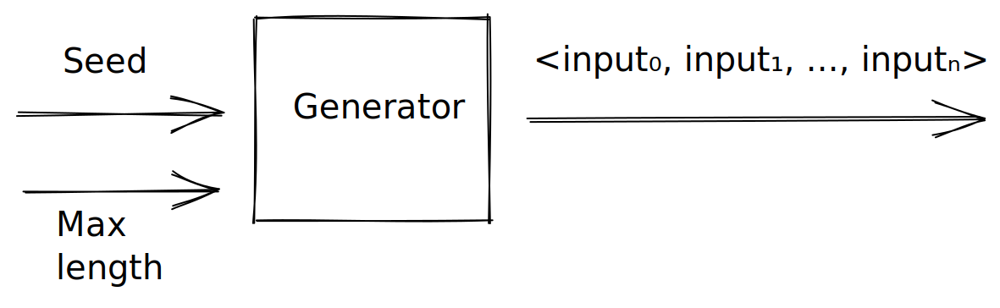

## State machine testing

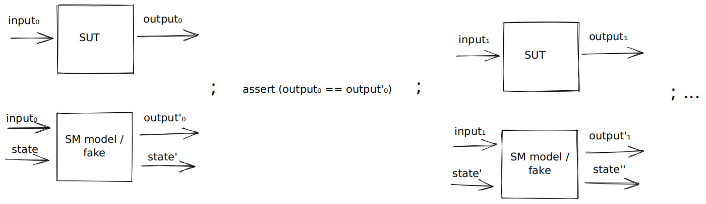

## Shrinking, when assertions fail

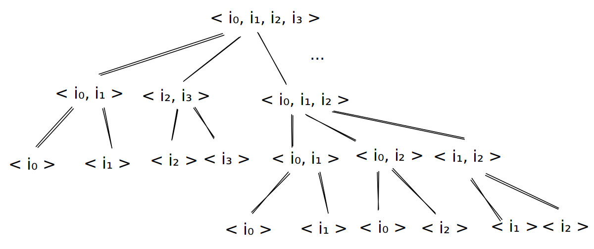

## Regression testing

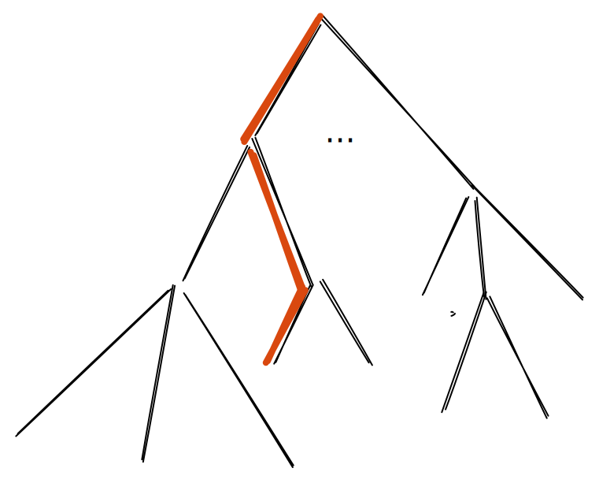

## Coverage

-   Risk when generating random test cases: are we generating interesting test cases?
-   How to measure coverage
-   Corner case thinking and unit tests as basis, e.g. try 0, -1, maxInt, etc

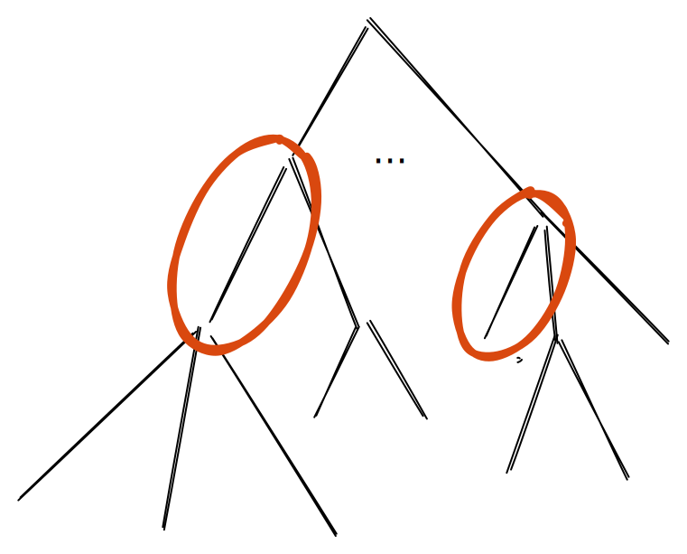

## SUT

``` haskell
module Lec01SMTesting where
```

``` haskell
import Control.Monad.IO.Class (MonadIO, liftIO)
import Data.IORef (IORef, newIORef, readIORef, writeIORef)
import Test.QuickCheck (Property, Gen, sample, quickCheck, withMaxSuccess, cover, classify,
                        forAllShrink, shrink, shrinkList, arbitrary, oneof, listOf)
import Test.QuickCheck.Monadic (run, monitor, monadicIO)
import Test.HUnit (Assertion, assertBool)
```

The software under test (SUT) of the day is a counter that can be incremented and read from. It’s implemented using a mutable reference (`IORef`) to an `Int`.

``` haskell
newtype Counter = Counter (IORef Int)
```

``` haskell
newCounter :: IO Counter
newCounter = do
  ref <- newIORef 0
  return (Counter ref)
```

``` haskell
incr :: Counter -> Int -> IO ()
incr (Counter ref) i = do
  j <- readIORef ref
  if j > 1000
  then writeIORef ref (i + j + 1) -- NOTE: this is a BUG!
  else writeIORef ref (i + j)
```

``` haskell
get :: Counter -> IO Int
get (Counter ref) = readIORef ref
```

## State machine model/specification/fake

The specification of our SUT is state machine model that uses a plain `Int` (unlike the real implementation it uses no mutable reference).

``` haskell
newtype FakeCounter = FakeCounter Int
  deriving Show
```

A state machine is a function from the current state and some input to the updated state and some output. We introduce two new types for the input and outputs:

``` haskell
data Command = Incr Int | Get
  deriving (Eq, Show)
```

``` haskell
data Response = Unit () | Int Int
  deriving (Eq, Show)
```

Next we define the initial state and the state machine function.

``` haskell
type Model = FakeCounter -- A.k.a. state
```

``` haskell
initModel :: Model
initModel = FakeCounter 0
```

``` haskell
step :: Model -> Command -> (Model, Response)
step m cmd = case cmd of
  Incr i -> Unit <$> fakeIncr m i
  Get    -> Int  <$> fakeGet m
  where
    fakeIncr :: FakeCounter -> Int -> (FakeCounter, ())
    fakeIncr (FakeCounter i) j = (FakeCounter (i + j), ())
```

``` haskell
    fakeGet :: FakeCounter -> (FakeCounter, Int)
    fakeGet (FakeCounter i) = (FakeCounter i, i)
```

## Testing library

Recall that we want generate a random program and then run it against the SUT and the state machine model and assert that the outputs match.

We want to generate random programs, so lets first define what a program is.

``` haskell
newtype Program = Program [Command]
  deriving Show
```

A program generator can now be defined using combinators provided by the property-based testing library.

``` haskell
genProgram :: Model -> Gen Program
genProgram _m = Program <$> listOf genCommand
```

``` haskell
genCommand :: Gen Command
genCommand = oneof [Incr <$> genInt, return Get]
```

``` haskell
genInt :: Gen Int
genInt = oneof [arbitrary] -- , elements [0, 1, maxBound, -1, minBound]] -- TODO: Fix coverage by uncommenting.
```

We can sample our program generator to get a feel for what kind of programs it generates.

``` haskell
samplePrograms :: IO ()
samplePrograms = sample (genProgram initModel)
```

In case we generate a program for which the state machine model and SUT disagree we’d like to shrink the program before presenting it to the user in order to make it easier to see what went wrong.

``` haskell
shrinkProgram :: Program -> [Program]
shrinkProgram (Program cmds) = [ Program (merge cmds') | cmds' <- shrinkList shrinkCommand cmds ]
  where
    merge []                        = []
    merge (Incr i : Incr j : cmds') = Incr (i + j) : merge cmds'
    merge (cmd : cmds')             = cmd : merge cmds'
```

``` haskell
shrinkCommand :: Command -> [Command]
shrinkCommand (Incr i) = [ Incr i' | i' <- shrink i ]
shrinkCommand Get      = []
```

Finally we have all the pieces necessary to write our property that generates programs, runs them against the SUT and the model, and asserts that the outputs are the same.

``` haskell
prop_counter :: Property
prop_counter = forallPrograms $ \prog -> monadicIO $ do
  c <- run newCounter
  let m = initModel
  (b, hist) <- runProgram c m prog
  monitor (coverage hist)
  return b
```

``` haskell
forallPrograms :: (Program -> Property) -> Property
forallPrograms p =
  forAllShrink (genProgram initModel) shrinkProgram p
```

``` haskell
runProgram :: MonadIO m => Counter -> Model -> Program -> m (Bool, Trace)
runProgram c0 m0 (Program cmds0) = go c0 m0 [] cmds0
  where
     go _c _m hist []           = return (True, reverse hist)
     go  c  m hist (cmd : cmds) = do
       resp <- liftIO (exec c cmd)
       let (m', resp') = step m cmd
       if resp == resp'
       then go c m' (Step m cmd resp m' : hist) cmds
       else return (False, reverse hist)
```

``` haskell
exec :: Counter -> Command -> IO Response
exec c cmd = case cmd of
  Incr i -> Unit <$> incr c i
  Get    -> Int  <$> get c
```

As a biproduct of running our generated program we also produce a trace of which commands gave what responses and what the state as before and after said command was executed.

``` haskell
type Trace = [Step]
```

``` haskell
data Step = Step
  { sModelBefore :: Model
  , sCommand     :: Command
  , sResponse    :: Response
  , sModelAfter  :: Model
  }
```

Such traces are useful for many things, for example ensuring that we got good coverage.

``` haskell
coverage :: Trace -> Property -> Property
coverage hist = classifyLength hist . classifyOverflow hist
  where
    classifyLength xs = classify (length xs == 0)                      "0 length"
                      . classify (0   < length xs && length xs <= 10)  "1-10 length"
                      . classify (10  < length xs && length xs <= 50)  "11-50 length"
                      . classify (50  < length xs && length xs <= 100) "51-100 length"
                      . classify (100 < length xs && length xs <= 300) "101-300 length"
                      . classify (300 < length xs && length xs <= 500) "301-500 length"
    classifyOverflow [] = id
```

``` haskell
    classifyOverflow (Step (FakeCounter c) (Incr i) _resp _model' : hist') =
       cover 2 (isOverflow c i) "overflow" . classifyOverflow hist'
    classifyOverflow (_ : hist') = classifyOverflow hist'
```

``` haskell
    isOverflow i j = toInteger i + toInteger j > toInteger (maxBound :: Int)
```

## Regression tests

When we find a counterexample that breaks our property we can add a regression test for it by merely copy-pasting the generated program into our test suite and using the following function, which does the same thing as our propery, but skips the generation step.

``` haskell
assertProgram :: String -> Program -> Assertion
assertProgram msg prog = do
  c <- newCounter
  let m = initModel
  (b, _hist) <- runProgram c m prog
  assertBool msg b
```

## Demo script

For the record, here are the steps we did interactively in the REPL during the lecture.

      > c <- newCounter
      > get c
      0
      > incr c 4
      > get c
      4

      > :t step
      step :: Model -> Command -> (Model, Response)
      > :i Command
      data Command = Incr Int | Get
      > let m = initModel
      > step m Get
      (FakeCounter 0, Int 0)
      > step m (Incr 4)
      (FakeCounter 4, Unit ())

      > sample genCommand
      Incr 0
      Incr (-1)
      Get
      Incr 2
      Get
      Get
      Incr (-9)
      Incr (-5)
      Incr (-3)
      Incr (-15)
      Get

      > sample (resize 400 genCommand)
      Incr 385
      Incr (-276)
      Incr 232
      Incr (-246)
      Get
      Get
      Incr (-392)
      Incr (-96)
      Incr (-158)
      Get
      Get

      > quickCheck prop_counter
      +++ OK, passed 100 tests:
      51% 11-50 length
      29% 1-10 length
      18% 51-100 length
       2% 0 length

      Only 0% overflow, but expected 2%

      > quickCheck (withMaxSuccess 10000 (noShrinking prop_counter))
      *** Failed! Falsified (after 498 tests):
      Program [Incr 95,Incr 51,Incr (-6),Get,Get,Get,Get,Incr (-69),Incr (-31),Get,Incr 68,Get,Get,Get,Incr 85,Get,Incr (-51),Get,Incr 77,Get,Get,Incr (-15),Get,Incr 65,Incr (-69),Get,Get,Get,Incr 54,Incr 95,Get,Incr 63,Incr 77,Get,Get,Incr 71,Incr 62,Incr (-57),Incr (-9),Get,Get,Incr (-84),Get,Incr 87,Incr (-30),Get,Get,Incr (-54),Incr 36,Get,Incr (-27),Incr 88,Get,Incr 78,Incr 62,Incr 95,Get,Incr 75,Incr 7,Incr (-24),Incr 32,Get,Incr 39,Incr 86,Incr 9,Incr (-12),Incr 97,Get,Get,Incr (-34),Incr 80,Incr 68,Get,Incr 83,Get,Get,Incr 82,Incr (-35),Incr (-25),Get,Incr 81,Incr (-71),Get,Incr 7]

      > quickCheck (withMaxSuccess 10000 prop_counter)
      *** Failed! Falsified (after 1199 tests and 22 shrinks):
      Program [Incr 1001,Get,Incr 0,Get]

## Discussion

-   Q: The specification is longer than the SUT!?

    A: For something as simple as a counter, this is true, but for any “real world” system that e.g. persists to disk the model will likely be smaller by an order of magnitude or more.

    The model can also be used for:

         - PoC / demo, before real implementation starts
         - documentation / on-boarding
         - race condition testing (lecture 2)
         - as a fake (lecture 3).

## Excerises

0.  If you’re not comfortable with Haskell, port the above code to your favorite programming language.

1.  Add a `Reset` `Command` which resets the counter to its initial value.

2.  Implement shrinking for programs.

3.  Write a REPL for the state machine. Start with the initial state, prompt the user for a command, apply the provided command to the step function and display the response as well as the new state, rinse and repeat.

    (For a SUT as simple as a counter this doesn’t make much sense, but when the SUT get more complicated it might make sense to develope the state machine specification first, demo it using something like a REPL or some other simple UI before even starting to implement the real thing.)

4.  Add a coverage check ensures that we do a `Get` after an overflow has happened.

5.  Write a display function for `Trace` which shows how the system evolved over time, the output could for example look like this:

<!-- -->

       state0
         == command0 ==> response0
       state1
         == command1 ==> response1
       ...

5.  Collect timing information about how long each command takes to execute on average.

## See also

-   For more on how feature interaction gives rise to bugs see the following [blog post](https://www.hillelwayne.com/post/feature-interaction/) by Hillel Wayne summarising [Pamela Zave](https://en.wikipedia.org/wiki/Pamela_Zave)’s work on the topic;

-   The original QuickCheck [paper](https://dl.acm.org/doi/pdf/10.1145/357766.351266) by Koen Claessen and John Hughes (2000) that introduced property-based testing in Haskell;

-   John Hughes’ Midlands Graduate School 2019 [course](http://www.cse.chalmers.se/~rjmh/MGS2019/) on property-based testing, which covers the basics of state machine modelling and testing. It also contains a minimal implementation of a state machine testing library built on top of Haskell’s QuickCheck;

-   John Hughes’ *Testing the Hard Stuff and Staying Sane* [talk](https://www.youtube.com/watch?v=zi0rHwfiX1Q) (2013-2014) stresses the importance of thinking about unit-test edge caseses and ensuring they are covered by the generators when doing property-based testing;

-   Lamport’s [Computation and State Machines](https://www.microsoft.com/en-us/research/publication/computation-state-machines/)

    2008) is an argument from a mathematical point of view why state machines are central in program correctness;

-   “Can one generalize Turing machines so that any algorithm, never mind how ab- stract, can be modeled by a generalized machine very closely and faithfully?”

    Perhaps somewhat surprisingly it turns out that the answer is yes, and the generalisation is a state machine! (This means that in some sense the state machine is the ultimate model?!)

    For details see Gurevich’s [generalisation](http://delta-apache-vm.cs.tau.ac.il/~nachumd/models/gurevich.pdf) of the Church-Turing thesis.

## Summary

Property-based testing lets us *generate unit tests* for pure functions/components, property-based testing using state machine models lets us generate unit tests for *stateful* functions/components.

---

# Concurrent state machine testing with linearisability

## Motivation

-   In the previous chapter we saw how to test if a sequential (single-threaded) program respects some state machine specification

-   Next we show how the *same* specification can be used to check if a concurrent execution is correct using linearisability

-   E.g. counters are often shared among different threads, how can we test that the counter implementation is thread-safe?

## Plan

-   Reuse the counter SUT and model from previous lecture;

-   Generate concurrent programs by instead of generating list of commands generate lists of lists of commands where the outer list represents commands that should be executed concurrently;

-   Collect a concurrent history of when each command started and finished executing on each thread;

-   Try to find a sequential path through the concurrent history that respects our sequential model, if we do we know that the concurrent execution is correct.

## How it works

## Concurrent history

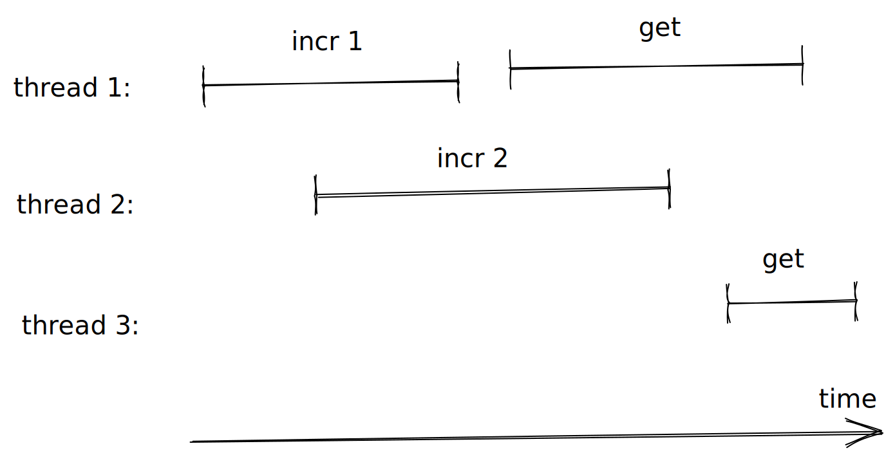

## Possible interleaving 1

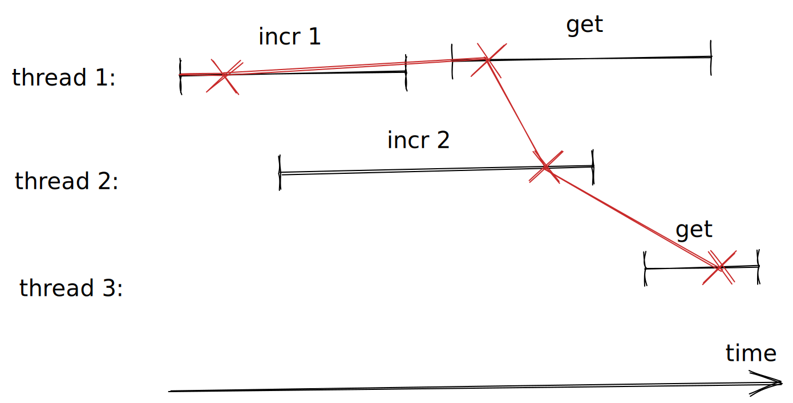

-   `< incr 1, get, incr 2, get >`

## Possible interleaving 2

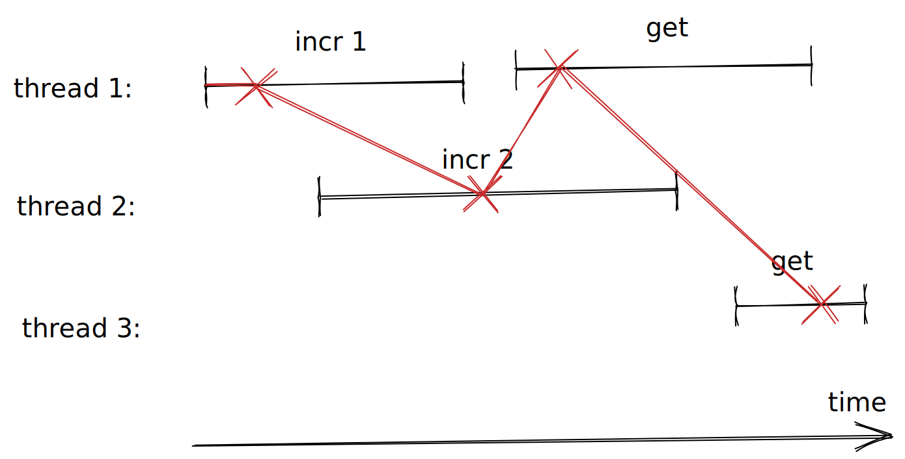

-   `< incr 1, incr 2, get, get >`

## Code

``` haskell
{-# LANGUAGE DeriveFunctor #-}
{-# LANGUAGE ScopedTypeVariables #-}
{-# LANGUAGE DeriveFoldable #-}
```

``` haskell
module Lec02ConcurrentSMTesting where
```

``` haskell
import Control.Concurrent (ThreadId, threadDelay, myThreadId)
import Control.Concurrent.Async (mapConcurrently)
import Control.Concurrent.STM (TQueue, flushTQueue, atomically, newTQueueIO, writeTQueue)
import Control.Monad (replicateM_, unless)
import Data.IORef (atomicModifyIORef')
import Data.List (permutations)
import Data.Tree (Forest, Tree(Node), drawForest)
import System.Random (randomRIO)
import Test.QuickCheck (Property, Gen, classify, shrinkList, tabulate, counterexample,
                        mapSize, sized, forAllShrinkShow, suchThat, vectorOf, chooseInt,
                        sample, quickCheck)
import Test.QuickCheck.Monadic (PropertyM, run, assert, monitor, monadicIO)
import Test.HUnit (Assertion, assertBool)
```

We will reuse the counter SUT and model from the previous lecture.

``` haskell
import Lec01SMTesting (Counter(Counter), Model, Command(Get, Incr), Response(Int, Unit),
                       initModel, get,  step, newCounter, exec, shrinkCommand, genCommand)
```

In order to do concurrent testing we need to generate concurrent programs though. In the sequential case a program was merely a list of commands, in the concurrent case a program is a list of lists of commands, where the inner list is what is supposed to be done concurrently.

``` haskell
newtype ConcProgram = ConcProgram { unConcProgram :: [[Command]] }
  deriving Show
```

``` haskell
forAllConcProgram :: (ConcProgram -> Property) -> Property
forAllConcProgram k =
  forAllShrinkShow (genConcProgram m) (shrinkConcProgram m) prettyConcProgram k
  where
    m = initModel
```

When generating concurrent programs we proceed in concurrent “chunks”, each chunk is between 2 and 5 commands and each command will be executed concurrently in a separate thread. In order for a command to be valid in a chunk it needs to be safe to execute said command independent of the order in which the rest of the commands are executed.

For a simple counter all commands are trivially safe, but imagine if we were working with for example filesystem commands then it might be unsafe to remove and rename a file in the same chunk.

When we are done generating a chunk, we advance the model by all commands in that chunk before we continue generating the next one.

``` haskell
genConcProgram :: Model -> Gen ConcProgram
genConcProgram m0 = sized (go m0 [])
  where
    go :: Model -> [[Command]] -> Int -> Gen ConcProgram
    go m acc sz | sz <= 0   = return (ConcProgram (reverse acc))
                | otherwise = do
                    n <- chooseInt (2, 5)
                    cmds <- vectorOf n genCommand `suchThat` concSafe m
                    go (advanceModel m cmds) (cmds : acc) (sz - n)
```

``` haskell
advanceModel :: Model -> [Command] -> Model
advanceModel m cmds = foldl (\ih cmd -> fst (step ih cmd)) m cmds
```

``` haskell
concSafe :: Model -> [Command] -> Bool
concSafe m = all (validProgram m) . permutations
```

``` haskell
validProgram :: Model -> [Command] -> Bool
validProgram _model _cmds = True
```

``` haskell
validConcProgram :: Model -> ConcProgram -> Bool
validConcProgram m0 (ConcProgram cmdss0) = go m0 True cmdss0
  where
    go :: Model -> Bool -> [[Command]] -> Bool
    go _m False _              = False
    go _m acc   []             = acc
    go m _acc   (cmds : cmdss) = go (advanceModel m cmds) (concSafe m cmds) cmdss
```

Shrinking concurrent programs is a bit more involved then below if we want to get nice minimal counterexamples, we’ll get back to this in one of the exercises.

``` haskell
shrinkConcProgram :: Model -> ConcProgram -> [ConcProgram]
shrinkConcProgram m
  = filter (validConcProgram m)
  . map ConcProgram
  . filter (not . null)
  . shrinkList (shrinkList shrinkCommand)
  . unConcProgram
```

``` haskell
prettyConcProgram :: ConcProgram -> String
prettyConcProgram = show
```

We cannot (easily) check for correctness while we are executing a concurrent program, instead we merely collect a concurrent history while executing and check this history after execution is done.

A history contains a chronologically ordered sequence of events of when a command was invoked and on what thread or process id, and when the command finished again together with which thread or process id. A single thread or process id may only be invoking a single command at the time.

``` haskell
newtype History' cmd resp = History [Operation' cmd resp]
  deriving (Show, Functor, Foldable)
```

``` haskell
type History = History' Command Response
```

``` haskell
newtype Pid = Pid Int
  deriving (Eq, Ord, Show)
```

``` haskell
data Operation' cmd resp
  = Invoke Pid cmd
  | Ok     Pid resp
  deriving (Show, Functor, Foldable)
```

``` haskell
type Operation = Operation' Command Response
```

``` haskell
toPid :: ThreadId -> Pid
toPid tid = Pid (read (drop (length ("ThreadId " :: String)) (show tid)))
```

``` haskell
appendHistory :: TQueue (Operation' cmd resp) -> Operation' cmd resp -> IO ()
appendHistory hist op = atomically (writeTQueue hist op)
```

When executing, the threads involved in the execution have a shared/concurrent queue which they append their invocation and completions to. From the concurrent queue we get our concurrent history.

``` haskell
concExec :: TQueue Operation -> Counter -> Command -> IO ()
concExec queue counter cmd = do
  pid <- toPid <$> myThreadId
  appendHistory queue (Invoke pid cmd)
  -- Adds some entropy to the possible interleavings.
  sleep <- randomRIO (0, 5)
  threadDelay sleep
  resp <- exec counter cmd -- threadSafeExec counter cmd -- NOTE: Fix the race condition by uncommenting.
  atomically (writeTQueue queue (Ok pid resp))
```

``` haskell
threadSafeExec :: Counter -> Command -> IO Response
threadSafeExec c cmd = case cmd of
  Incr i -> Unit <$> threadSafeIncr c i
  Get    -> Int  <$> get c
  where
    threadSafeIncr (Counter ref) i = atomicModifyIORef' ref (\j -> (i + j, ()))
```

With a concurrent history we can generate all possible single-threaded executions.

``` haskell
interleavings :: History' cmd resp -> Forest (cmd, resp)
interleavings (History [])  = []
interleavings (History ops0) =
  [ Node (cmd, resp) (interleavings (History ops'))
  | (tid, cmd)   <- takeInvocations ops0
  , (resp, ops') <- findResponse tid
                      (filter1 (not . matchInvocation tid) ops0)
  ]
  where
    takeInvocations :: [Operation' cmd resp] -> [(Pid, cmd)]
    takeInvocations []                         = []
    takeInvocations ((Invoke pid cmd)   : ops) = (pid, cmd) : takeInvocations ops
    takeInvocations ((Ok    _pid _resp) : _)   = []
```

``` haskell
    findResponse :: Pid -> [Operation' cmd resp] -> [(resp, [Operation' cmd resp])]
    findResponse _pid []                                   = []
    findResponse  pid ((Ok pid' resp) : ops) | pid == pid' = [(resp, ops)]
    findResponse  pid (op             : ops)               =
      [ (resp, op : ops') | (resp, ops') <- findResponse pid ops ]
```

``` haskell
    matchInvocation :: Pid -> Operation' cmd resp -> Bool
    matchInvocation pid (Invoke pid' _cmd) = pid == pid'
    matchInvocation _   _                  = False
```

``` haskell
    filter1 :: (a -> Bool) -> [a] -> [a]
    filter1 _ []                   = []
    filter1 p (x : xs) | p x       = x : filter1 p xs
                       | otherwise = xs
```

If any one of the single-threaded executions respects the state machine model, then the concurrent execution is correct. This correctness criteria is the main result from the “linearizability” paper linked to below.

``` haskell
linearisable :: forall model cmd resp. Eq resp
             => (model -> cmd -> (model, resp)) -> model -> Forest (cmd, resp) -> Bool
linearisable step0 model0 = any' (go model0)
  where
    go :: model -> Tree (cmd, resp) -> Bool
    go model (Node (cmd, resp) ts) =
      let
        (model', resp') = step0 model cmd
      in
        resp == resp' && any' (go model') ts
```

``` haskell
    any' :: (a -> Bool) -> [a] -> Bool
    any' _p [] = True
    any'  p xs = any p xs
```

We now have all the pieces necessary to implement our concurrent property.

Note that in order to avoid being unlucky with the execution interleavings we actually execute the same generated test case ten times.

``` haskell
prop_concurrent :: Property
prop_concurrent = mapSize (min 20) $
  forAllConcProgram $ \(ConcProgram cmdss) -> monadicIO $ do
    monitor (classifyCommandsLength (concat cmdss))
    -- Rerun a couple of times, to avoid being lucky with the interleavings.
    monitor (tabulate "Commands" (map constructorString (concat cmdss)))
    monitor (tabulate "Number of concurrent commands" (map (show . length) cmdss))
    replicateM_ 10 $ do
      counter <- run newCounter
      queue <- run newTQueueIO
      run (mapM_ (mapConcurrently (concExec queue counter)) cmdss)
      hist <- History <$> run (atomically (flushTQueue queue))
      assertWithFail (linearisable step initModel (interleavings hist)) (prettyHistory hist)
  where
    constructorString :: Command -> String
    constructorString Incr {} = "Incr"
    constructorString Get  {} = "Get"
```

``` haskell
assertWithFail :: Monad m => Bool -> String -> PropertyM m ()
assertWithFail condition msg = do
  unless condition $
    monitor (counterexample ("Failed: " ++ msg))
  assert condition
```

``` haskell
classifyCommandsLength :: [cmd] -> Property -> Property
classifyCommandsLength cmds
  = classify (length cmds == 0)                        "length commands: 0"
  . classify (0   < length cmds && length cmds <= 10)  "length commands: 1-10"
  . classify (10  < length cmds && length cmds <= 50)  "length commands: 11-50"
  . classify (50  < length cmds && length cmds <= 100) "length commands: 51-100"
  . classify (100 < length cmds && length cmds <= 200) "length commands: 101-200"
  . classify (200 < length cmds && length cmds <= 500) "length commands: 201-500"
  . classify (500 < length cmds)                       "length commands: >501"
```

``` haskell
prettyHistory :: (Show cmd, Show resp) => History' cmd resp -> String
prettyHistory = show
```

``` haskell
displayInterleavings :: (Show cmd, Show resp) => History' cmd resp -> IO ()
displayInterleavings = putStrLn . drawForest . fmap (fmap show) . interleavings
```

## Regression testing

``` haskell
assertHistory :: String -> History -> Assertion
assertHistory _msg hist =
  assertBool (prettyHistory hist) (linearisable step initModel (interleavings hist))
```

## Demo script

      > sample (genConcProgram initModel)
      ConcProgram []
      ConcProgram [[Incr 2,Incr 2,Get,Incr 0,Get]]
      ConcProgram [[Incr 3,Get,Incr 1,Incr 0]]
      ConcProgram [[Incr (-1),Get],[Get,Get],[Get,Get]]
      ConcProgram [[Get,Get,Incr 2,Get],[Get,Get,Incr (-5),Incr 8,Get]]
      ConcProgram [[Incr (-5),Incr (-1),Incr 7,Get],[Incr 3,Get,Get],[Get,Incr 5,Incr 0,Get,Incr 6]]
      ConcProgram [[Get,Get,Get,Get,Get],[Get,Get,Incr (-3),Incr 5],[Incr (-11),Incr (-6),Incr (-2)]]
      ConcProgram [[Incr 13,Get,Incr (-9)],[Incr (-13),Incr (-5),Incr (-4),Get],[Get,Incr 12,Incr 1,Incr 2,Get],[Incr (-10),Incr 10,Incr 11]]
      ConcProgram [[Get,Get,Get,Incr 4],[Get,Incr (-16),Get,Incr (-5)],[Incr (-9),Get,Incr (-10),Get,Incr 13],[Incr 11,Get,Get,Get]]
      ...

      > quickCheck prop_concurrent
      ConcProgram [[Incr 0,Incr 14],[Get,Get,Get]]

      Failed: History [Invoke (Pid 296705) (Incr 0),Invoke (Pid 296707) (Incr 14),Ok (Pid 296707) (Unit ()),Ok (Pid 296705) (Unit ()),Invoke (Pid 296709) Get,Invoke (Pid 296711) Get,Ok (Pid 296709) (Int 0),Invoke (Pid 296713) Get,Ok (Pid 296711) (Int 0),Ok (Pid 296713) (Int 0)]

      Pid 296705: |---- Incr 0 -------|
      Pid 296707:   |--- Incr 14 ---|
      Pid 296709:                       |--- Get => 0 ---|
      Pid 296711:                         |---- Get => 0----------|
      Pid 296713:                                          |---- Get => 0 ---|

      > displayInterleavings (History [Invoke (Pid 296705) (Incr 0),Invoke (Pid 296707) (Incr 14),Ok (Pid 296707) (Unit ()),Ok (Pid 296705) (Unit ()),Invoke (Pid 296709) Get,Invoke (Pid 296711) Get,Ok (Pid 296709) (Int 0),Invoke (Pid 296713) Get,Ok (Pid 296711) (Int 0),Ok (Pid 296713) (Int 0)])

    (Incr 0,Unit ())
    |
    `- (Incr 14,Unit ())
       |
       +- (Get,Int 0)
       |  |
       |  +- (Get,Int 0)
       |  |  |
       |  |  `- (Get,Int 0)
       |  |
       |  `- (Get,Int 0)
       |     |
       |     `- (Get,Int 0)
       |
       `- (Get,Int 0)
          |
          `- (Get,Int 0)
             |
             `- (Get,Int 0)

    (Incr 14,Unit ())
    |
    `- (Incr 0,Unit ())
       |
       +- (Get,Int 0)
       |  |
       |  +- (Get,Int 0)
       |  |  |
       |  |  `- (Get,Int 0)
       |  |
       |  `- (Get,Int 0)
       |     |
       |     `- (Get,Int 0)
       |
       `- (Get,Int 0)
          |
          `- (Get,Int 0)
             |
             `- (Get,Int 0)

## Discussion

-   Black- vs white-box testing: if you think of the SUT as a box, then checking for race conditions using linearisability requires no insight or changes to what is going on in the box, i.e. it’s a black-box technique. On the other hand, if one is ready to give access to or make changes to the box to facilitate testing then we may apply so called white-box techniques. An example of a white-box technique is Go’s [race detector](https://go.dev/blog/race-detector) or the Haskell library [dejafu](https://hackage.haskell.org/package/dejafu).

-   Linearisability is by no means an intuitive concept, it will take a while before it sinks in. Meanwhile, feel free to ask questions.

## Exercises

0.  Can you figure out ways to improve the shrinking? (Hint: see parallel shrinking in [`quickcheck-state-machine`](https://hackage.haskell.org/package/quickcheck-state-machine).)

1.  How can you test that the shrinking is good/optimal? (Hint: see how `labelledExamples` is used in the [*An in-depth look at quickcheck-state-machine*](https://www.well-typed.com/blog/2019/01/qsm-in-depth/) blog post by Edsko de Vries and [*Building on developers’ intuitions to create effective property-based tests*](https://www.youtube.com/watch?v=NcJOiQlzlXQ) talk by John Hughes)

2.  Display counterexample in a way that makes it easier to see what went wrong. (Hint: perhaps taking inspiration from the diagrams in the beginning of this lecture.)

## See also

-   [*Finding Race Conditions in Erlang with QuickCheck and PULSE*](http://www.cse.chalmers.se/~nicsma/papers/finding-race-conditions.pdf)

    2009) ([video](https://vimeo.com/6638041)) – this paper describes how Erlang’s (closed source) version QuickCheck does concurrent testing (it was the first property-based testing library to do so);

-   [*Linearizability: a correctness condition for concurrent objects*](https://cs.brown.edu/~mph/HerlihyW90/p463-herlihy.pdf)\] (1990), this is a classic paper that describes the main technique of the concurrent property;

-   Kyle “aphyr” Kingsbury’s blogposts about Jepsen, which also uses linearisability, and has found [bugs](http://jepsen.io/analyses) in many distributed systems:

    -   [Knossos: Redis and linearizability](https://aphyr.com/posts/309-knossos-redis-and-linearizability);

    -   [Strong consistency models](https://aphyr.com/posts/313-strong-consistency-models);

    -   [Computational techniques in Knossos](https://aphyr.com/posts/314-computational-techniques-in-knossos);

    -   [Serializability, linearizability, and locality](https://aphyr.com/posts/333-serializability-linearizability-and-locality).

## Summary

When you got a state machine model of a program, you can get race conditions testing for free.

---

# Consumer-driven contract testing using state machines

## Motivation

-   Components rarely exist in isolation, they almost always depend on some other component;

-   When we test we often want to test as if the component existed in isolation though, e.g. if component A depends on component B, we’d like to test B first and then *assume* that B is working when testing A;

-   Assumptions like these can be justified using so called *contract tests*, which is what we will be looking at next.

## Plan

1.  Following the pattern from lecture 1: make a state machine (SM) model of the dependency B, use SM testing to ensure that the model is faithful to the real implementation of B (these tests are our contract tests);

2.  Turn the SM model of B into a fake and use it in-place of the real implementation of B inside the real implementation of A;

3.  Repeat the first step for for component A. Note that while testing A we will not be using the real component B but rather a fake of it, this gives us possibly faster and more deterministic integration tests.

## How it works

## SUT with real queue

The SUT of the day is a web service which queues up client requests and has a worker that processes the queue and replies to the clients.

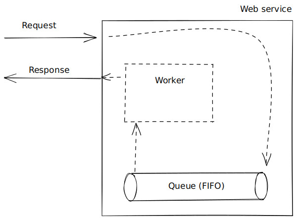

Imagine if this queue is a separate process. This makes it a bit annoying to test because we need to deploy the queue first, make sure it’s ready for work before we start testing the web service.

## SUT with interface

One way around the above problem is to implement the web service against an *interface* of the queue rather than the queue itself. We can then implement this interface using the real queue but also a fake queue which lives in the same process as the web service hence avoiding deploying the queue before testing. Depending if we deploy the web service in “production” or for “testing” we choose the between the two implementations of the interface.

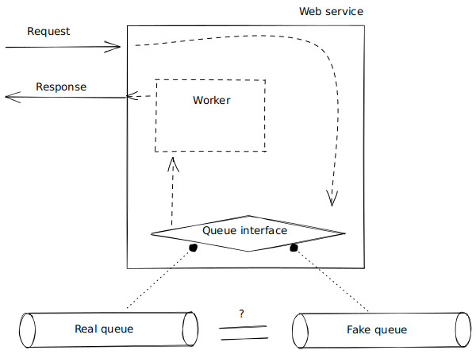

The problem of this approach is: how do we know that the fake queue is faithful to the real queue implementation? We would need to test this somehow! (These tests are usually called contract tests.)

## Recall: SM testing

Let’s take a step back and recall what we are doing when we are state machine testing. We ensure that the state machine model is faithful to the SUT.

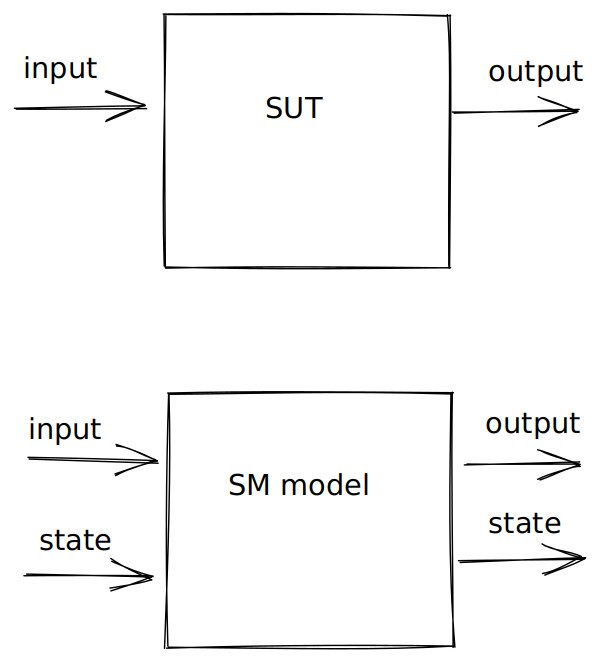

## SM model fake

Assuming we have a state machine model of the queue which we know is faithful to the real queue, is there a way to turn this model into a fake and hence solve our problem?

Yes! It’s quite simple, merely create a wrapper around the state machine model which has a variable with the current state. Initialise this current state with the initial model, and every time we get an input, read the state, apply the state machine function, update the state variable.

(Note that the model isn’t a fake because it doesn’t have the same in- and outputs – that’s what the wrapper fixes.)

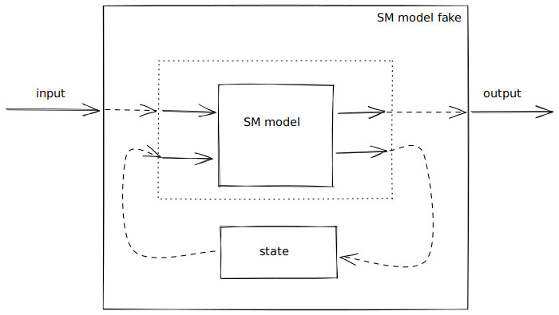

## “Collaboration tests” vs contract tests

Let’s zoom out a bit and contemplate the general picture. Our queue can be thought of as a producer of the interface, while the web service is consumer of it.

                   Interface
                       |
        Consumer       |     Producer
                       |
           ----------> x-------->
                       |
      "Collaboration   |  Contract tests
          tests"       |

When we integration test our web service against the fake queue we are doing, what is sometimes called, “collaboration tests”, while when we are ensuring that the fake queue is faithful to the real queue we are doing contract tests.

The above relations between consumers and producers of interfaces can be generalised from one-to-one relations, as in the web service and queue example, to many-to-many relations and we can also nest them, i.e. a producer can in turn be a consumer. The kind of testing we’ve talked about generalised to these contexts as well and done in “layers”, starting with the bottom layer and going up.

## Consumer-driven contract tests

The job of contract tests are to ensure the accuracy of the fakes you use of other components in your fast and deterministic integration tests.

*Consumer-driven* contract tests just means that the consumer of the faked API writes the contract test inside the test-suite of the producer.

If component A and B are developed in different repos or by different teams, then the consumer of the API (in our case A consumes B’s API) should write the contract test (hence *consumer-driven*).

That way:

1.  the fake of the consumed API is more to encode the assumptions that the consumer makes;

2.  if the implementation of the consumed API changes in a way that break the contract test that ensures that the fake is faithfully with regards to the real implementation, then the developers of the consumed API will get a failing test and thus a warning about the fact that some assumptions of the consumer might have been broken.

So with other words, consumer-driven is just a policy about who writes which contract tests and where those tests are supposed to live, and by following this policy we are more likely to catch if a producer of an API makes a change that will break the interaction between the consumer and the producer.

## Code

``` haskell
module Lec03SMContractTesting where
```

``` haskell
import Lec03.QueueInterface ()
import Lec03.Queue ()
import Lec03.QueueTest ()
```

``` haskell
import Lec03.Service ()
import Lec03.ServiceTest ()
```

## Discussion

Why not just spin up the real component B when testing component A?

-   Imagine B is a queue and the real implementation uses Kafka, then we’d need to start several processes…

-   Sometimes component B is slow to use (uses disk or network I/O)…

-   Sometimes component B is a third-party component which we can’t redeploy or reset between test runs…

-   Often we want to be resilient at the level of component A in case component B fails, injecting faults in B to test this is much easier on a fake of B rather than on the real implementation of B (more on this in the next lecture).

-   Basically this is how the road towards slow and flaky tests starts. Don’t go down that path! If you are thinking: “but some code is only exercised when the real component is deployed, e.g. configuration”, then use [smoke tests](https://en.wikipedia.org/wiki/Smoke_testing_%28software%29) rather than integration tests with real components.

    Origin of the terminology: “The phrase smoke test comes from electronic hardware testing. You plug in a new board and turn on the power. If you see smoke coming from the board, turn off the power. You don’t have to do any more testing.”

    The software analogue: spin up component(s), wait for their status to become “ready”, make some basic requests and see if they succeed.

    Acceptable if these are a bit flaky:

    -   Component spin up happens relatively rarely in production
    -   These tests will likely involve docker containers and networking, i.e. third-party infrastructure that sometimes is flaky

    “After code reviews, smoke testing is the most cost effective method for identifying and fixing defects in software.” – [Microsoft](https://docs.microsoft.com/en-us/previous-versions/ms182613(v=vs.80))

    For most software systems, between good contract tests and smoke tests there shouldn’t be much of a gap for bugs to sneak in. For special cases, such as distributed systems, we will cover more comprehensive techniques in lecture 5.

## Exercises

0.  The fake/model of the queue is thread-safe, but the real implementation isn’t! Fix that and do concurrent contract testing.

1.  Introduce an interface for all database interaction, move the current database implementation to `realDb` and introduce fake database instance of the interface.

2.  Write contract tests that ensure that the fake database faithfully represents the real one.

3.  Once the contract tests pass, switch out the real database for the fake one in the collaboration tests (the test-suite of the web service). Enable timing output in `ghci` with `:set +s`, crank up the number of tests that `QuickCheck` generates, and see if you notice any speed up in the test execution time.

4.  Think of corner cases for the queue you’d write unit tests for, but instead add those cases to the coverage checker to ensure that the generator generates them.

## See also

-   For the difference between a fake and e.g. a mock see the following [article](https://www.martinfowler.com/bliki/TestDouble.html) by Martin Fowler;

-   For more on contract testing see this [article](https://martinfowler.com/bliki/ContractTest.html) and for more on their consumer-driven variant see the following [article](https://martinfowler.com/articles/consumerDrivenContracts.html);

-   [*Integrated Tests Are A Scam*](https://www.youtube.com/watch?v=fhFa4tkFUFw) talk by J.B. Rainsberger (2022), this a less ranty version of a talk with the same title that he [gave](https://www.youtube.com/watch?v=VDfX44fZoMc) at DevConFu in 2013.

## Summary

-   State machine testing a component using a model gives us a faithful fake for that component for free;

-   Using fakes enables to fast and deterministic integration tests and, as we shall see next, makes it easier to introduce faults when testing;

-   Contract tests justify the use of fakes, in-place of the real dependencies, when testing a SUT.

---

# Fault-injection

## Motivation

-   “almost all (92%) of the catastrophic system failures are the result of incorrect handling of non-fatal errors explicitly signaled in software. \[…\] in 58% of the catastrophic failures, the underlying faults could easily have been detected through simple testing of error handling code.” – [Simple Testing Can Prevent Most Critical Failures: An Analysis of Production Failures in Distributed Data-intensive Systems](http://www.eecg.toronto.edu/~yuan/papers/failure_analysis_osdi14.pdf)
    2014) Yuan et al.
-   “[Jepsen](https://jepsen.io/analyses) has analyzed over two dozen databases, coordination services, and queues – and we’ve found replica divergence, data loss, stale reads, read skew, lock conflicts, and much more.”

## Plan

-   Create a wrapper around our fake queue implementation which allows us to inject faults

-   Possible faults to inject for the queue

    -   write fails, e.g. queue is full
    -   read fails, e.g. queue is empty
    -   read crashes, e.g. bug in queue causes exception to be thrown
    -   read returns a malformed write which no longer deserialises, or has an invalid client request id to send the response to

-   Use the same web service model that we wrote in the previous lecture and do integration/“collaboration” tests with the fake queue with faults to ensure that our web service, that uses the queue, doesn’t crash even if the presence of faults in the queue

-   Notice that we don’t have to make any changes to the model to account of the possible faults, the linearisability checker does this for us behind the scenes

## How it works

## How faults get injected

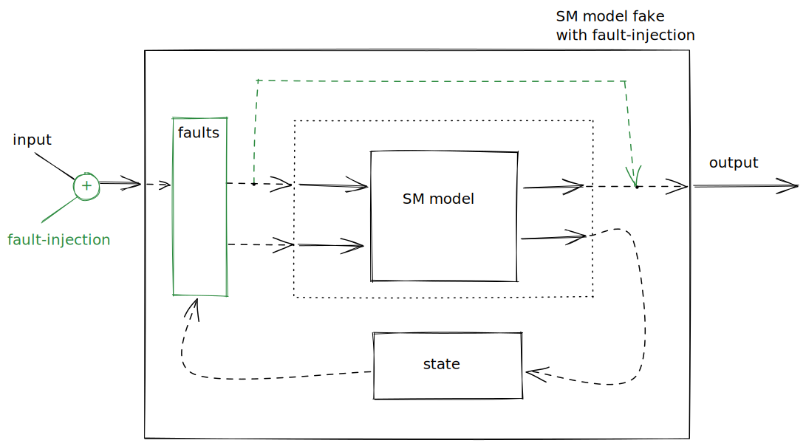

## Different types of faults

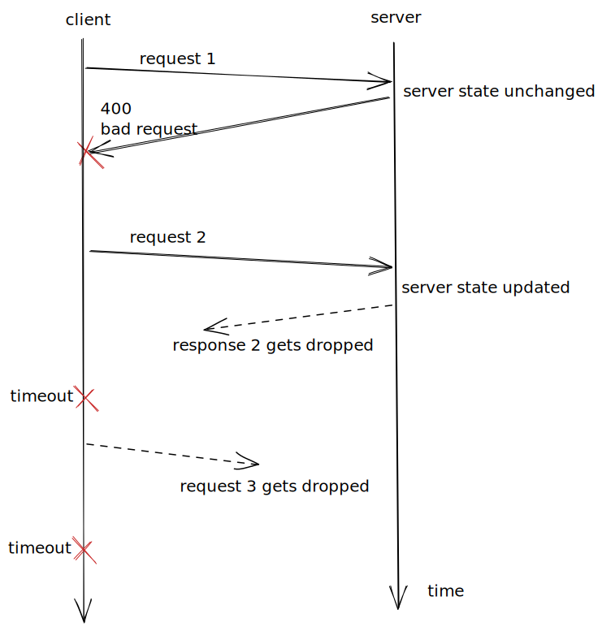

## How linearisability checker deals with faults

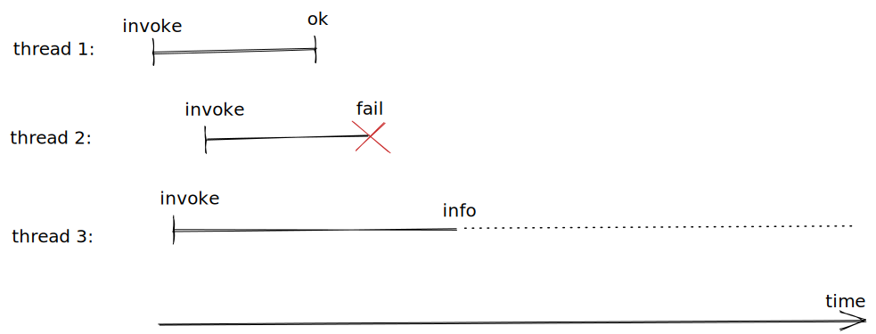

## Code

``` haskell
{-# LANGUAGE OverloadedStrings #-}
{-# LANGUAGE NumericUnderscores #-}
{-# LANGUAGE ScopedTypeVariables #-}
```

``` haskell
module Lec04FaultInjection
  ( module Lec04FaultInjection
  , module Lec03.ServiceTest
  , module Test.QuickCheck
  )
  where
```

``` haskell
import Control.Monad (replicateM_)
import Control.Concurrent (threadDelay, myThreadId)
import Control.Concurrent.Async (mapConcurrently)
import Control.Concurrent.STM (TQueue, atomically, flushTQueue, newTQueueIO)
import Data.Vector (Vector)
import qualified Data.Vector as Vector
import Data.ByteString.Lazy (ByteString)
import qualified Data.ByteString.Lazy as LBS
import Control.Exception
import Control.Monad.IO.Class (MonadIO, liftIO)
import Data.IORef
import Data.List (permutations)
import Test.HUnit (Assertion, assertBool)
import Test.QuickCheck hiding (Result)
import Test.QuickCheck.Monadic hiding (assert)
import Network.HTTP.Types (status503)
import Network.HTTP.Client (HttpException(HttpExceptionRequest),
                            HttpExceptionContent(StatusCodeException), Manager,
                            defaultManagerSettings, newManager, responseStatus,
                            managerResponseTimeout, responseTimeoutMicro)
```

We have to generalise the notion of histories and linearisability from the second lecture to deal with faults, but otherwise the idea is the same.

``` haskell
import Lec02ConcurrentSMTesting (assertWithFail, classifyCommandsLength, toPid)
import Lec03.Service (withService, mAX_QUEUE_SIZE, fakeQueue, realQueue)
import Lec03.QueueInterface
import Lec03.ServiceTest (Index(Index), httpWrite, httpRead, httpReset)
import Lec04.LineariseWithFault (History'(History), Operation'(..), FailureMode(..), interleavings,
                                 linearisable, prettyHistory, appendHistory)
```

A queue which supports fault-injection is merely a queue and a mutable variable that might contain a fault.

``` haskell
data FaultyFakeQueue a = FaultyFakeQueue
  { ffqQueue :: QueueI a
  , ffqFault :: IORef (Maybe Fault)
  }
```

The possible faults that we support are that the queue is full (write fails), that its empty (read fails), read throwing an exception (due to some implementation bug perhaps), and slow read (simulating a GC or I/O pause).

``` haskell
data Fault = Full | Empty | ReadFail IOException | ReadSlow
  deriving Show
```

We can now create a wrapper around our fake queue which inserts the right failure points depending which fault is injected. Note that a fault is only active in until it’s triggered.

``` haskell
faultyFakeQueue :: Int -> IO (FaultyFakeQueue a)
faultyFakeQueue size = do
  fake <- fakeQueue size
  ref  <- newIORef Nothing
  return FaultyFakeQueue
    { ffqQueue = QueueI
        { qiEnqueue = enqueue fake ref
        , qiDequeue = dequeue fake ref
        }
    , ffqFault = ref
    }
  where
    enqueue :: QueueI a -> IORef (Maybe Fault) -> a -> IO Bool
    enqueue fake ref x = do
      fault <- readIORef ref
      case fault of
        Just Full -> do
          removeFault ref
          return False
        _otherwise -> qiEnqueue fake x
```

``` haskell
    dequeue :: QueueI a -> IORef (Maybe Fault) -> IO (Maybe a)
    dequeue fake ref = do
      fault <- readIORef ref
      case fault of
        Just Empty -> do
          removeFault ref
          return Nothing
        Just (ReadFail err) -> do
          removeFault ref
          throwIO err
        Just ReadSlow -> do
          removeFault ref
          threadDelay 200_000 -- 0.2s
          qiDequeue fake
        _otherwise -> qiDequeue fake
```

To make it a bit easier to work with fault-injection we introduce the following helper functions.

``` haskell
injectFullFault :: IORef (Maybe Fault) -> IO ()
injectFullFault ref = writeIORef ref (Just Full)
```

``` haskell
injectEmptyFault :: IORef (Maybe Fault) -> IO ()
injectEmptyFault ref = writeIORef ref (Just Empty)
```

``` haskell
injectReadFailFault :: IORef (Maybe Fault) -> IOException -> IO ()
injectReadFailFault ref err = writeIORef ref (Just (ReadFail err))
```

``` haskell
injectReadSlowFault :: IORef (Maybe Fault) -> IO ()
injectReadSlowFault ref = writeIORef ref (Just ReadSlow)
```

``` haskell
removeFault :: IORef (Maybe Fault) -> IO ()
removeFault ref = writeIORef ref Nothing
```

The following unit test should give an idea of how the fake queue with support for fault-injection works.

``` haskell
test_injectFullFault :: Assertion
test_injectFullFault = do
  ffq <- faultyFakeQueue 4
  res1 <- qiEnqueue (ffqQueue ffq) ("test1" :: String)
  assert (res1 == True) (return ())
  injectFullFault (ffqFault ffq)
  res2 <- qiEnqueue (ffqQueue ffq) "test2"
  assert (res2 == False) (return ())
```

## Sequential integration/“collaboration” testing

The notion of program needs to be generalised to include fault-injection, but otherwise it should look familiar.

``` haskell
newtype Program = Program { unProgram :: [Command] }
  deriving Show
```

``` haskell
data Command
  = ClientRequest ClientRequest
  | InjectFault Fault
  | Reset -- Used for testing only.
  deriving Show
```

``` haskell
data ClientRequest = WriteReq ByteString | ReadReq Index
  deriving Show
```

``` haskell
data ClientResponse = WriteResp Index | ReadResp ByteString
  deriving (Eq, Show)
```

The model is the same as for the web service from last lecture.

``` haskell
type Model = Vector ByteString
```

``` haskell
initModel :: Model
initModel = Vector.empty
```

Generating and shrinking programs is the same as well, modulo fault-injection.

``` haskell
forallPrograms :: (Program -> Property) -> Property
forallPrograms p =
  forAllShrink (genProgram initModel) shrinkProgram p
```

``` haskell
genProgram :: Model -> Gen Program
genProgram m0 = sized (go m0 [])
  where
    go _m cmds 0 = return (Program (reverse cmds))
    go  m cmds n = do
      cmd <- genCommand m
      let m' = fst (step m cmd)
      go m' (cmd : cmds) (n - 1)
```

``` haskell
genCommand :: Model -> Gen Command
genCommand m0 = frequency [ (1, InjectFault <$> genFault)
                          , (9, ClientRequest <$> genRequest m0)
                          ]
  where
    genRequest :: Model -> Gen ClientRequest
    genRequest m | len == 0  = WriteReq <$> (LBS.pack <$> arbitrary)
                 | otherwise = frequency
                     [ (2, WriteReq <$> (LBS.pack <$> arbitrary))
                     , (8, ReadReq  <$> (Index <$> elements [0 .. len - 1]))
                     ]
      where
        len = Vector.length m
```

``` haskell
    genFault :: Gen Fault
    genFault = frequency [ (1, pure Full)
                         , (1, pure Empty)
                         , (1, pure (ReadFail (userError "bug")))
                         , (1, pure ReadSlow)
                         ]
```

``` haskell
shrinkProgram :: Program -> [Program]
shrinkProgram (Program cmds) = filter (isValidProgram initModel) ((map Program (shrinkList shrinkCommand cmds)))
  where
    shrinkCommand _cmd = []
```

``` haskell
isValidProgram :: Model -> Program -> Bool
isValidProgram _m (Program _cmds) = True
```

Stepping the model is slightly different in that the injecting faults command don’t give a client response.

``` haskell
step :: Model -> Command -> (Model, Maybe ClientResponse)
step m cmd = case cmd of
  ClientRequest (WriteReq bs) ->
    ( Vector.snoc m bs
    , Just (WriteResp (Index (Vector.length m)))
    )
  ClientRequest (ReadReq (Index ix)) ->
    ( m
    , ReadResp <$> m Vector.!? ix
    )
  InjectFault _fault -> (m, Nothing)
  Reset              -> (initModel, Nothing)
```

Likewise executing commands against the real SUT is different in the same way, but also because we need to deal with the different failure modes that result from the possilbe faults being injected.

``` haskell
data Result a = ROk a | RFail | RInfo | RNemesis
  deriving Show
```

``` haskell
exec :: Command -> IORef (Maybe Fault) -> Manager -> IO (Result ClientResponse)
exec (ClientRequest req) _ref mgr =
  case req of
    WriteReq bs -> do
      res <- try (httpWrite mgr bs)
      case res of
        -- NOTE: 503 means the worker queue is full, so the request gets dropped, so we can treat it as a failure.
        Left (err :: HttpException) | is503 err -> return RFail
                                    | otherwise -> return RInfo
        Right ix -> return (ROk (WriteResp ix))
    ReadReq ix  -> do
      res <- try (httpRead mgr ix)
      case res of
        -- NOTE: since read doesn't change the state we can always treat is a failure.
        Left (_err :: HttpException) -> return RFail
        Right bs -> return (ROk (ReadResp bs))
    where
      is503 :: HttpException -> Bool
      is503 (HttpExceptionRequest _req (StatusCodeException resp _bs)) = responseStatus resp == status503
      is503 _otherwise = False
exec (InjectFault fault)  ref _mgr = do
  case fault of
    Full         -> injectFullFault ref
    Empty        -> injectEmptyFault ref
    ReadFail err -> injectReadFailFault ref err
    ReadSlow     -> injectReadSlowFault ref
  return RNemesis
exec Reset _ref mgr = do
  httpReset mgr
  return RNemesis
```

But otherwise the sequential property should look familiar.

``` haskell
prop_seqIntegrationTests :: IORef (Maybe Fault) -> Manager -> Property
prop_seqIntegrationTests ref mgr = forallPrograms $ \prog -> monadicIO $ do
  r <- runProgram ref mgr initModel prog
  run (removeFault ref)
  run (httpReset mgr)
  case r of
    Left err -> do
      monitor (counterexample err)
      return False
    Right () -> return True
```

The only difference is in the run program function which needs to take the failure modes into account.

``` haskell
runProgram :: MonadIO m => IORef (Maybe Fault) -> Manager -> Model -> Program -> m (Either String ())
runProgram ref mgr m0 (Program cmds0) = go m0 cmds0
  where
    go _m []           = return (Right ())
    go  m (cmd : cmds) = do
      res <- liftIO (exec cmd ref mgr)
      case res of
        ROk resp -> do
          let (m', mResp') = step m cmd
          case mResp' of
            Just resp' | resp == resp' -> go m' cmds
                       | otherwise     -> return (Left (concat [show resp, " /= ", show resp']))
            Nothing -> return (Left (concat [show res, " /= ", show mResp']))
        RFail -> go m cmds
        -- For more see the "Crashes" section of https://jepsen.io/consistency
        RInfo -> return (Left "Continuing would violate the single-threaded constraint: processes only do one thing at a time.")
        RNemesis -> do
          let (m', mResp') = step m cmd
          case mResp' of
            Nothing     -> go m' cmds
            Just _resp' -> return (Left (concat [show res, " /= ", show mResp']))
```

Like in the previous lecture, the sequential and concurrent properties assume that the web service is up and running, so we will define a couple of helpers for getting the web service up and running with different queues.

Recall from the last lecture that in the main function of the web service we can branch on, say, a command-line flag in order to determine which queue implementation to use, e.g. the real queue for “production” deployment and the fake one with faults for a “testing” deployment.

``` haskell
withFaultyQueueService :: (Manager -> IORef (Maybe Fault) -> IO ()) -> IO ()
withFaultyQueueService io = do
  queue <- faultyFakeQueue mAX_QUEUE_SIZE
  mgr   <- newManager defaultManagerSettings
             { managerResponseTimeout = responseTimeoutMicro (10_000_000) } -- 10s
  withService (ffqQueue queue) (io mgr (ffqFault queue))
```

``` haskell
withFakeQueueService :: (Manager -> IO ()) -> IO ()
withFakeQueueService io = do
  queue <- fakeQueue mAX_QUEUE_SIZE
  mgr   <- newManager defaultManagerSettings
  withService queue (io mgr)
```

``` haskell
withRealQueueService :: (Manager -> IO ()) -> IO ()
withRealQueueService io = do
  queue <- realQueue mAX_QUEUE_SIZE
  mgr   <- newManager defaultManagerSettings
  withService queue (io mgr)
```

Finally we can write our sequential integratin tests with a fake and possibly faulty queue.

``` haskell
unit_seqIntegrationTests :: IO ()
unit_seqIntegrationTests =
  withFaultyQueueService (\mgr ref -> quickCheck (prop_seqIntegrationTests ref mgr))
```

Regression tests can be added similarly to before.

``` haskell
assertProgram :: String -> Program -> Assertion
assertProgram msg prog =
  withFaultyQueueService $ \mgr ref -> do
    let m = initModel
    r <- runProgram ref mgr m prog
    assertBool msg (isRight r)
  where
    isRight Right {} = True
    isRight Left  {} = False
```

## Concurrent integration/“collaboration” testing

Generating and shrinking concurrent programs is same as before.

``` haskell
newtype ConcProgram = ConcProgram { unConcProgram :: [[Command]] }
  deriving Show
```

``` haskell
forAllConcProgram :: (ConcProgram -> Property) -> Property
forAllConcProgram k =
  forAllShrinkShow (genConcProgram initModel) (shrinkConcProgram initModel)
                   prettyConcProgram k
  where
```

``` haskell
    genConcProgram :: Model -> Gen ConcProgram
    genConcProgram m0 = sized (go m0 [])
      where
        go :: Model -> [[Command]] -> Int -> Gen ConcProgram
        go m acc sz | sz <= 0   = return (ConcProgram (reverse acc))
                    | otherwise = do
                        n <- chooseInt (2, 3)
                        cmds <- vectorOf n (genCommand m) `suchThat` concSafe m
                        go (advanceModel m cmds) (cmds : acc) (sz - n)
```

``` haskell
    advanceModel :: Model -> [Command] -> Model
    advanceModel m cmds = foldl (\ih cmd -> fst (step ih cmd)) m cmds
```

``` haskell
    concSafe :: Model -> [Command] -> Bool
    concSafe m = all (isValidProgram m . Program) . permutations
```

``` haskell
    validConcProgram :: Model -> ConcProgram -> Bool
    validConcProgram m0 (ConcProgram cmdss0) = go m0 True cmdss0
      where
        go :: Model -> Bool -> [[Command]] -> Bool
        go _m False _              = False
        go _m acc   []             = acc
        go  m _acc  (cmds : cmdss) = go (advanceModel m cmds) (concSafe m cmds) cmdss
```

``` haskell
    shrinkConcProgram :: Model -> ConcProgram -> [ConcProgram]
    shrinkConcProgram m
      = filter (validConcProgram m)
      . map ConcProgram
      . filter (not . null)
      . shrinkList (shrinkList shrinkCommand)
      . unConcProgram
      where
        shrinkCommand _cmd = []
```

``` haskell
    prettyConcProgram :: ConcProgram -> String
    prettyConcProgram = show
```

Executing commands concurrent is also same as before, except histories are not richer as they need to contain the failure modes.

``` haskell
type Operation = Operation' Command (Maybe ClientResponse)
```

``` haskell
concExec :: IORef (Maybe Fault) -> Manager -> TQueue Operation -> Command -> IO ()
concExec ref mgr hist cmd = do
  pid <- toPid <$> myThreadId -- XXX: we can't reuse crashed pids...
  appendHistory hist (Invoke pid cmd)
  res <- exec cmd ref mgr
  case res of
    ROk resp -> appendHistory hist (Ok pid (Just resp))
    RFail    -> appendHistory hist (Fail pid FAIL)
    RInfo    -> appendHistory hist (Fail pid INFO)
    RNemesis -> appendHistory hist (Ok pid Nothing)
```

The concurrent property should look familiar as well.

``` haskell
-- NOTE: Assumes that the service is running.
prop_concIntegrationTests :: IORef (Maybe Fault) -> Manager -> Property
prop_concIntegrationTests ref mgr = mapSize (min 20) $
  forAllConcProgram $ \(ConcProgram cmdss) -> monadicIO $ do
    monitor (classifyCommandsLength (concat cmdss))
    monitor (tabulate "Client requests" (map constructorString (concat cmdss)))
    monitor (tabulate "Number of concurrent client requests" (map (show . length) cmdss))
    -- Rerun a couple of times, to avoid being lucky with the interleavings.
    replicateM_ 10 $ do
      history <- run newTQueueIO
      run (mapM_ (mapConcurrently (concExec ref mgr history)) cmdss)
      hist <- History <$> run (atomically (flushTQueue history))
      assertWithFail (linearisable step initModel (interleavings hist)) (prettyHistory hist)
      run (removeFault ref)
      run (httpReset mgr)
  where
    constructorString :: Command -> String
    constructorString (ClientRequest WriteReq {}) = "WriteReq"
    constructorString (ClientRequest ReadReq  {}) = "ReadReq"
    constructorString (InjectFault Full)          = "Full"
    constructorString (InjectFault Empty)         = "Empty"
    constructorString (InjectFault ReadFail {})   = "ReadFail"
    constructorString (InjectFault ReadSlow {})   = "ReadSlow"
    constructorString Reset                       = "Reset"
```

And again, because the property assumes that the web service is running, so we stand the service up first.

``` haskell
unit_concIntegrationTests :: IO ()
unit_concIntegrationTests = do
  -- NOTE: fake queue is used here, justified by previous contract testing.
  ffq <- faultyFakeQueue mAX_QUEUE_SIZE
  mgr <- newManager defaultManagerSettings
  withService (ffqQueue ffq) (quickCheck (prop_concIntegrationTests (ffqFault ffq) mgr))
```

## Demo script

      > test_injectFullFault
      > unit_seqIntegrationTests
      > -- Uncomment BUGs in `Service` module and show how the seq property catches them.
      > unit_concIntegrationTests

## Discussion

-   Can we not just inject real faults like Jepsen does? [`iptables`](https://linux.die.net/man/8/iptables) for dropping messages and network partitions, [`tc`](https://man7.org/linux/man-pages/man8/tc.8.html) for creating latency or simulating a slow connection on the network, [`(p)kill`](https://linux.die.net/man/1/kill) for killing processes, `kill -STOP   $pid` and `kill -CONT $pid` for pausing and resuming processes to simulate long I/O or GC pauses, [`libfaketime`](https://github.com/wolfcw/libfaketime) for clock-skews, etc?

    We could, after all Jepsen is a very successful at finding bugs in distributed databases using these techniques. However keep in mind exactly how Jepsen is used: typically companies hire Kyle Kingsbury for a couple of weeks/months, he writes the tests and runs them, analyses the results and writes a report. Presumably while he is writing this report he runs the tests many times, getting many false positivies and flaky test runs, but since doing this analysis is his main focus he can filter out the signal from the noise. If you wanna run these tests in CI however all this noise will cause a lot of context switches and pretty fast get annoying.

    Other downsides include:

    -   many of the above fault-injections requires root access, or they need to be done in containers or a VM which slows things down and complicates start up;
    -   imprecise (e.g. `iptables` can’t drop exactly the 42nd message and only if it’s a read);
    -   non-deterministic (failing test cases cannot always be reproduced reliably);
    -   no shrinking (i.e. no minimal counterexamples);
    -   slow (we need to wait for timeouts to happend, say, \~30-90 secs)
    -   ci flakiness (e.g. `docker pull` failing)

-   What about [Chaos engineering](https://en.wikipedia.org/wiki/Chaos_engineering)?

    -   Chaos engineering has the same downsides as Jepsen when it comes to being slow and non-deterministic

    -   It’s important to remember in which context it was developed: Netflix (hundreds(?) of already designed and deployed systems spanning datacentres around the globe), unless you are in that same situation then the fault injection techniques discussed here are far simpler to implement

    -   Works at a different level, e.g. “over 5% of the traffic receives 500 errors”, rather than “assertion A failed at line number L”, i.e. test failures will pin-point you much more precisely to where the problem is

    -   Tests production configurations, as well as monitoring and alerting

    -   In conclusion: chaos engineering is complementary to what we discribed here, but probably less bang for the buck and should be done later – remember the quote from the motivation: “\[…\] in 58% of the catastrophic failures, the underlying faults could easily have been detected through simple testing of error handling code.”

-   It can be tempting to modelling the faults, this moves some non-determinism out from linearisability checker into the model. This is possible, but based from our experience not recommended as it complicated the model.

## Exercises

0.  Try to imagine how much more difficult it would be to write these tests without injecting the faults in the fake, but rather the real dependency.

1.  All our faults are in the dependency, i.e. the queue, what if we wanted to inject a fault at the web service level?

2.  If our faults are completely deterministic, can we avoid `info`s altogether?

3.  The concurrent property doesn’t reveal any bugs that the sequential property already doesn’t catch, can you think of a way of introducing a bug in the SUT which only the concurrent tests can catch? If not, can you think of a way of extending/writing a different the SUT to enable this? (Hint: think about what kind of SUT Jepsen is pointed at.)

## Problems

0.  Can we do better than randomly inserting faults? (Hint: see [*Lineage-driven Fault Injection*](https://people.ucsc.edu/~palvaro/molly.pdf) by Alvaro et al

    2015) and the [`ldfi`](https://github.com/symbiont-io/detsys-testkit/tree/main/src/ldfi) directory in the `detsys-testkit` repo)

1.  Faults in the real world are often correlated with each other, i.e. if one thing fails it’s likely it will overload some other thing making it more likely to fail and so on, how can we simulate this in a good way?

2.  There’re multiple other design decisions around faults that can be explored, e.g. should faults be baked into `Command` like we did above or should they be separate from the commands, i.e. something like this `Program = Program    [Fault] [Command]`? Should faults be one-shots like we did above, or should they have a “fault off” command? Or should they be time based, i.e. “this fault is active between t0 and t1”?

3.  What’s better at finding bugs: i) a small fixed agenda and try many faults and interleavings, or ii) a big random agenda and fewer interleavings?

4.  Can we contract test the fault injection? I.e. how do we know that the faults we inject correspond to real faults that can happen? How can we be sure to have covered all possible real faults?

    To answer questions of this kind it helps to specify fault models, for an example of this see `tigerbeetle`’s [documentation](https://github.com/coilhq/tigerbeetle/blob/main/docs/DESIGN.md#fault-models), one then manually needs to convince oneself of the fact that the fault models are covered by the fault injection.

## See also

-   \[*Why Is Random Testing Effective for Partition Tolerance Bugs?*(https://dl.acm.org/doi/pdf/10.1145/3158134) by Majumdar and Niksic
    2018) 
-   The [`failpoint`](https://github.com/pingcap/failpoint) Go library allows us to insert failures at any point in our code, in some way this is a cheap-and-dirty way of achiving the same thing as we’ve done in this lecture. Cheap because it’s less work, dirty because it litters the (production) code with fail points (our fail points are hidden in the fake).

## Summary

-   Most catastrophic system failures are related to error handling, fault-injection allows us to trigger error handling code and therefore increase our coverage to catch these failures before they happen in production;

-   Fault-injection is much easier to do determinstically when using fakes.

---

``` haskell
module Lec05SimulationTesting where
```

``` haskell
import Lec05.EventLoop ()
```

# Simulation testing

## Motivation

-   “haven’t tested foundation\[db\] in part because their testing appears to be waaaay more rigorous than mine.” – Kyle [“aphyr”](https://twitter.com/aphyr/status/405017101804396546) Kingsbury

-   [“Jepsen-proof engineering”](https://sled.rs/simulation.html)

-   “Everyone knows that debugging is twice as hard as writing a program in the first place.” – Brian Kernighan

## Plan

-   What interface does the event loop provide?
    -   Send/recv messages
    -   Timers
    -   File I/O
-   Implement this interface twice:
    1.  Real implementation
    2.  Simulation, where outgoing messages are intercepted and scheduled at random but deterministically using a seed (or dropped to simulate e.g. network partitions)


The following pseudo code implementation of the event loop works for both the “real” deployment and simulation:

    while true {
      msg := deliver()
      out := recv(msg)
      send(out)
    }

by switching out the implementation of `send` from sending messages over the network to merely adding the message to priority queue, and switching out the implementation of `deliever` from listning on a socket to merely popping messages off the priority queue, then we can switch between a “real” deployment and simulation by merely switching between different implementations of the event loops interface (`send` and `deliver`).

-   Inspiration for faults: https://en.wikipedia.org/wiki/Fallacies_of_distributed_computing

## Exercises

0.  Add a way to record all inputs during production deployment

1.  Add a way to produce a history from the recorded inputs

2.  Add a debugger that works on the history, similar to the REPL from the first lecture

3.  Write a checker that works on histories that ensures that the safety properites from section 8 on correctness from [*Viewstamped Replication Revisited*](https://pmg.csail.mit.edu/papers/vr-revisited.pdf) by Barbara Liskov and James Cowling (2012)

-   https://making.pusher.com/fuzz-testing-distributed-systems-with-quickcheck/
-   https://fractalscapeblog.wordpress.com/2017/05/05/quickcheck-for-paxos/

## See also

-   Where do these ideas come from?

    The first reference we been able to find is the following concluding remark by Alan Perlis (the first recipient of the Turing Award) about a discussion about a paper on simulation testing by Brian Randell at the first [conference](http://homepages.cs.ncl.ac.uk/brian.randell/NATO/nato1968.PDF) on Software Engineering (this is where we got the term from) in 1968:

    “I’d like to read three sentences to close this issue.

         1. A software system can best be designed if the testing is interlaced with
            the designing instead of being used after the design.

         2. A simulation which matches the requirements contains the control which
            organizes the design of the system.

         3. Through successive repetitions of this process of interlaced testing and
            design the model ultimately becomes the software system itself. I think that it
            is the key of the approach that has been suggested, that there is no such
            question as testing things after the fact with simulation models, but that in
            effect the testing and the replacement of simulations with modules that are
            deeper and more detailed goes on with the simulation model controlling, as it
            were, the place and order in which these things are done."

-   The idea in its current shape and as applied to distributed systems was introduced(?), or at the very least popularised, by Will Wilson’s talk [*Testing Distributed Systems w/ Deterministic Simulation*](https://www.youtube.com/watch?v=4fFDFbi3toc) at Strange Loop

    2014) about how they used [simulation testing](https://apple.github.io/foundationdb/testing.html) to test [FoundationDB](https://www.foundationdb.org/) (so well that Kyle “aphyr” Kingsbury didn’t feel it was [worth](https://twitter.com/aphyr/status/405017101804396546) Jepsen testing it).

    Watching the talk and rereading the Perlis quote makes one wonder: was the technique independently rediscovered, or had they in fact read the (in)famous 1968 NATO software engineering report?

-   There’s also the more established practice of [discrete-event simulation](https://en.wikipedia.org/wiki/Discrete-event_simulation) which is usually used in different contexts than software testing, but nevertheless is close enough in principle that it’s worth taking inspiration from (and indeed the simulation testing people often refer to it).

-   Other users of simulation testing include.

    -   AWS

Here’s a quote from the recently published paper [Millions of Tiny Databases](https://www.usenix.org/conference/nsdi20/presentation/brooker) (2020) written by three AWS engineers:

“To solve this problem \[testing distributed systems\], we picked an approach that is in wide use at Amazon Web Services, which we would like to see broadly adopted: build a test harness which abstracts networking, performance, and other systems concepts (we call it a simworld). The goal of this approach is to allow developers to write distributed systems tests, including tests that simulate packet loss, server failures, corruption, and other failure cases, as unit tests in the same language as the system itself. In this case, these unit tests run inside the developer’s IDE (or with junit at build time), with no need for test clusters or other infrastructure. A typical test which tests correctness under packet loss can be implemented in less than 10 lines of Java code, and executes in less than 100ms. The Physalia team have written hundreds of such tests, far exceeding the coverage that would be practical in any cluster-based or container-based approach.

The key to building a simworld is to build code against abstract physical layers (such as networks, clocks, and disks). In Java we simply wrap these thin layers in interfaces. In production, the code runs against implementations that use real TCP/IP, DNS and other infrastructure. In the simworld, the implementations are based on in-memory implementa- tions that can be trivially created and torn down. In turn, these in-memory implementations include rich fault-injection APIs, which allow test implementors to specify simple statements like: `net.partitionOff ( PARTITION_NAME , p5.getLocalAddress () ); ...   net.healPartition ( PARTITION_NAME );`

Our implementation allows control down to the packet level, allowing testers to delay, duplicate or drop packets based on matching criteria. Similar capabilities are available to test disk IO. Perhaps the most important testing capability in a distributed database is time, where the framework allows each actor to have it’s own view of time arbitrarily controlled by the test. Simworld tests can even add Byzantine conditions like data corruption, and operational properties like high la- tency. We highly recommend this testing approach, and have continued to use it for new systems we build.”

    + Dropbox

      * https://dropbox.tech/infrastructure/rewriting-the-heart-of-our-sync-engine
      * https://lobste.rs/s/ob6a8z/rewriting_heart_our_sync_engine

    + Basho

     * [Riak](https://speakerdeck.com/jtuple/hansei-property-based-development-of-concurrent-systems)
       (a distributed NoSQL key-value data store that offers high availability, fault
       tolerance, operational simplicity, and scalability)

    + IOHK

From their recent [paper](http://www.cse.chalmers.se/~rjmh/tfp/proceedings/TFP_2020_paper_11.pdf) “Flexibility with Formality: Practical Experience with Agile Formal Methods in Large-Scale Functional Programming” (2020):

“Both the network and consensus layers must make significant use of concurrency which is notoriously hard to get right and to test. We use Software Transactional Memory(STM) to manage the internal state of a node. While STM makes it much easier to write correct concurrent code, it is of course still possible to get wrong, which leads to intermittent failures that are hard to reproduce and debug.

In order to reliably test our code for such concurrency bugs, we wrote a simulator that can execute the concurrent code with both timing determinism and giving global observability, producing execution traces. This enables us to write property tests that can use the execution traces and to run the tests in a deterministic way so that any failures are always reproducible. The use of the mini-protocol design pattern, the encoding of protocol interactions in session types and the use of a timing reproducable simulation has yielded several advantages:

-   Adding new protocols (for new functionality) with strong assurance that they will not interact adversly with existing functionality and/or performance consistency.

-   Consistent approaches (re-usable design approaches) to issues of latency hiding, intra mini-protocol flow control and timeouts / progress criteria.

-   Performance consistent protocol layer abstraction / subsitution: construct real world realistic timing for operation without complexity of simulating all the underlying layer protocol complexity. This helps designs / development to maintain performance target awareness during development.

-   Consitent error propagation and mitigation (mini protocols to a peer live/die together) removing issues of resource lifetime management away from mini-protocol designers / implementors.”

The simulation code is open source and can be found [here](https://github.com/input-output-hk/ouroboros-network/tree/master/io-sim).

---

``` haskell
module Lec06WhiteboxCheckers where
```

## Motivation

-   Previously we’ve seen how to black-box test our system, but simulation gives us full insight into what’s happening inside “the box” so we can write more interesting white-box checkers

## See also

-   The `detsys` [`ltl`](https://github.com/symbiont-io/detsys-testkit/tree/main/src/ltl) checker
-   [Quickstrom](https://arxiv.org/abs/2203.11532v1)
-   [HasCal](https://github.com/Gabriel439/HasCal)

## Exercises

0.  Can we model check our state machines a la TLC/HasCal while retaining the possibility to simulate and “production deploy” them? (Hint: see the [P](https://github.com/p-org/P) programming language.)

---

``` haskell
module Lec07EfficientEventLoop where
```

## Motivation

-   Our event loop is deterministic which allows for simulation, but it’s not the most efficient in terms of how fast and how much traffic it can serve

## Plan

-   Pipelining (shared multi-cast queue a la LMAX’ disruptor)
-   Journal?

## See also

-   The Linux kernel’s [io_uring](https://kernel.dk/io_uring.pdf) interface
-   [aeron](https://github.com/real-logic/aeron)

---

``` haskell
module Lec08AsyncFileSystemIO where
```

## Motivation

-   Filesystem I/O is slow and blocks the event loop

## See also

-   [Continuations](https://matt.might.net/articles/programming-with-continuations--exceptions-backtracking-search-threads-generators-coroutines/)
-   [Goblins](https://docs.racket-lang.org/goblins/)
-   [E programming language](https://en.wikipedia.org/wiki/E_(programming_language))

---

``` haskell
module Lec09SMUpgrades where
```

# State machine upgrades

## Motivation

-   How do we upgrade the state machines?

## Plan

-   Versioning of all messages
-   Codec upgrades
-   State machine upgrades
-   Seralisation of state machines?

## See also

-   Erlang hot-code swapping

---

``` haskell
module Lec10LibraryOrFramework where
```

## Motivation

-   How can we take everything we’ve done so far and pack it up in a nice way so that many different applications can be written, easily communicate with each other all while being conveniently debuggable?

## See also

-   Jane Street’s [Concord](https://signalsandthreads.com/state-machine-replication-and-why-you-should-care/) framework

-   Chuck’s Bandwagon framework

-   OCaml’s [Eio](https://ocaml-multicore.github.io/eio/eio/Eio/index.html) and its [`io_uring`](https://en.wikipedia.org/wiki/Io_uring) [backend](https://ocaml-multicore.github.io/eio/eio_linux/Eio_linux/index.html)

---

