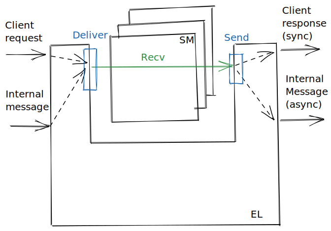

``` {.haskell .literate}
module ATMC where
```

Advanced property-based testing mini-course
===========================================

-   Goals:
    -   Show how to test stateful (i.e. impure/monadic) programs using property-based testing in general;
    -   Show how to use fault injection and so called simulation testing to test distributed systems in particular;
    -   Introduce the reader to related work and open problems in the area.
-   Pre-requisites:
    -   Enough familiarity with Haskell to be able to read simple programs;

    -   Basic knowledge of state machines (i.e. Mealy and Moore machines)

        -   https://en.wikipedia.org/wiki/Finite-state\_transducer
        -   [Computation and State Machines](https://www.microsoft.com/en-us/research/publication/computation-state-machines/)
            (2008)  by Leslie Lamport

    -   Some experience with property-based testing of non-stateful (i.e. pure) programs.

        -   The original paper: [QuickCheck: a lightweight tool for random testing of Haskell programs](http://www.cs.tufts.edu/~nr/cs257/archive/john-hughes/quick.pdf)
            (2000)  by Koen Claessen and John Hughes

Table of contents
-----------------

``` {.haskell .literate}
import ATMC.Lec1SMTesting
```

1.  State machine testing

-   State machine models
-   Pre-conditions
-   Coverage
-   Execution trace for counterexamples
-   Regression tests from counterexamples
-   Metrics
-   References?

``` {.haskell .literate}
import ATMC.Lec2ConcurrentSMTesting
```

2.  Concurrent state machine testing with linearisability

-   Generalise generation and execution to N threads
-   Collect history
-   Enumerate all possible sequential executions from concurrent history
-   Write simple linearisability checker: check if there's any such sequential execution that satisifies the (sequential) state machine model

``` {.haskell .literate}
import ATMC.Lec3SMContractTesting
```

3.  Consumer-driven contract tests using state machines

``` {.haskell .literate}
import ATMC.Lec4FaultInjection
```

4.  Fault-injection

``` {.haskell .literate}
import ATMC.Lec5SimulationTesting
```

5.  Simulation testing

---

``` {.haskell .literate}
module ATMC.Lec1SMTesting where
```

``` {.haskell .literate}
import Control.Monad.IO.Class
import Data.IORef
import Test.QuickCheck
import Test.QuickCheck.Monadic
import Test.HUnit
```

State machine testing
=====================

Motivation
----------

-   Testing: "the process of using or trying something to see if it works, is suitable, obeys the rules, etc." -- Cambridge dictionary

-   In order to check that the software under test (SUT) obeys the rules we must first write down the rules

-   State machine specifications are one of many ways to formally "write down the rules"

SUT
---

``` {.haskell .literate}
newtype Counter = Counter (IORef Int)
```

``` {.haskell .literate}
newCounter :: IO Counter
newCounter = do
  ref <- newIORef 0
  return (Counter ref)
```

``` {.haskell .literate}
incr :: Counter -> IO ()
incr (Counter ref) = do
  n <- readIORef ref
  writeIORef ref (n + 1)
```

``` {.haskell .literate}
get :: Counter -> IO Int
get (Counter ref) = readIORef ref
```

State machine model/specification/fake
--------------------------------------

``` {.haskell .literate}
newtype FakeCounter = FakeCounter Int
```

``` {.haskell .literate}
fakeIncr :: FakeCounter -> (FakeCounter, ())
fakeIncr (FakeCounter i) = (FakeCounter (i + 1), ())
```

``` {.haskell .literate}
fakeGet :: FakeCounter -> (FakeCounter, Int)
fakeGet (FakeCounter i) = (FakeCounter i, i)
```

``` {.haskell .literate}
data Command = Incr | Get
  deriving (Eq, Show)
```

``` {.haskell .literate}
data Response = Unit () | Int Int
  deriving (Eq, Show)
```

``` {.haskell .literate}
type Model = FakeCounter
```

``` {.haskell .literate}
initModel :: Model
initModel = FakeCounter 0
```

``` {.haskell .literate}
step :: Model -> Command -> (Model, Response)
step m cmd = case cmd of
  Incr -> Unit <$> fakeIncr m
  Get  -> Int  <$> fakeGet m
```

``` {.haskell .literate}
exec :: Counter -> Command -> IO Response
exec c cmd = case cmd of
  Incr -> Unit <$> incr c
  Get  -> Int  <$> get c
```

``` {.haskell .literate}
newtype Program = Program [Command]
  deriving Show
```

``` {.haskell .literate}
genCommand :: Gen Command
genCommand = elements [Incr, Get]
```

``` {.haskell .literate}
genProgram :: Model -> Gen Program
genProgram _m = Program <$> listOf genCommand
```

``` {.haskell .literate}
validProgram :: Model -> [Command] -> Bool
validProgram _mode _cmds = True
```

``` {.haskell .literate}
shrinkCommand :: Command -> [Command]
shrinkCommand _cmd = []
```

``` {.haskell .literate}
shrinkProgram :: Program -> [Program]
shrinkProgram _prog = [] -- Exercises.
```

``` {.haskell .literate}
prop_counter :: Property
prop_counter = forAll (genProgram initModel) $ \prog -> monadicIO $ do
  c <- run newCounter
  let m = initModel
  runProgram c m prog
```

``` {.haskell .literate}
runProgram :: MonadIO m => Counter -> Model -> Program -> m Bool
runProgram c0 m0 (Program cmds) = go c0 m0 cmds
  where
     go _c _m []           = return True
     go  c  m (cmd : cmds) = do
       resp <- liftIO (exec c cmd)
       let (m', resp') = step m cmd
       if resp == resp'
       then go c m' cmds
       else return False
```

Regression tests
----------------

``` {.haskell .literate}
assertProgram :: String -> Program -> Assertion
assertProgram msg prog = do
  c <- newCounter
  let m = initModel
  b <- runProgram c m prog
  assertBool msg b
```

Excerises
---------

0.  Add a `Reset` `Command` which resets the counter to its initial value.

1.  Implement shrinking for programs.

2.  Write a REPL for the state machine. Start with the initial state, prompt the user for a command, apply the provided command to the step function and display the response as well as the new state, rinse and repeat.

    (For a SUT as simple as a counter this doesn't make much sense, but when the SUT get more complicated it might make sense to develope the state machine specification first, demo it using something like a REPL or some other simple UI before even starting to implement the real thing.)

3.  Collect timing information about how long each command takes to execute on average.

See also
--------

-   Why state machines over other forms of specifications? E.g. unit test-suite.
    -   Executable (as the REPL exercise shows, but also more on this later)
    -   Mental model
    -   Gurevich's generalisation of the Church-Turing thesis
    -   Already heavily used in distributed systems (later we'll see how the model becomes the implementation)

---

``` {.haskell .literate}
{-# LANGUAGE DeriveFunctor #-}
{-# LANGUAGE DeriveFoldable #-}
```

``` {.haskell .literate}
module ATMC.Lec2ConcurrentSMTesting where
```

``` {.haskell .literate}
import Control.Concurrent
import Control.Concurrent.Async
import Control.Concurrent.STM
import Control.Concurrent.STM.TQueue
import Control.Monad
import Data.List (permutations)
import Data.Tree (Forest, Tree(Node))
import System.Random
import Test.QuickCheck
import Test.QuickCheck.Monadic
import Test.HUnit hiding (assert)
```

``` {.haskell .literate}
import ATMC.Lec1SMTesting
```

Concurrent state machine testing with linearisability
=====================================================

Motivation
----------

-   In the previous chapter we saw how to test if a sequential (single-threaded) program respects some state machine specification

-   Next we show how the *same* specification can be used to check if a concurrent execution is correct using linearisability

-   E.g. counters are often shared among different threads, how can we test that the counter implementation is thread-safe?

``` {.haskell .literate}
newtype ConcProgram = ConcProgram { unConcProgram :: [[Command]] }
  deriving Show
```

``` {.haskell .literate}
forAllConcProgram :: (ConcProgram -> Property) -> Property
forAllConcProgram k =
  forAllShrinkShow (genConcProgram m) (shrinkConcProgram m) prettyConcProgram k
  where
    m = initModel
```

``` {.haskell .literate}
genConcProgram :: Model -> Gen ConcProgram
genConcProgram m0 = sized (go m0 [])
  where
    go :: Model -> [[Command]] -> Int -> Gen ConcProgram
    go m acc sz | sz <= 0   = return (ConcProgram (reverse acc))
                | otherwise = do
                    n <- chooseInt (2, 5)
                    cmds <- vectorOf n genCommand `suchThat` concSafe m
                    go (advanceModel m cmds) (cmds : acc) (sz - n)
```

``` {.haskell .literate}
advanceModel :: Model -> [Command] -> Model
advanceModel m cmds = foldl (\ih cmd -> fst (step ih cmd)) m cmds
```

``` {.haskell .literate}
concSafe :: Model -> [Command] -> Bool
concSafe m0 = all (validProgram m0) . permutations
```

``` {.haskell .literate}
validConcProgram :: Model -> ConcProgram -> Bool
validConcProgram m0 (ConcProgram cmdss0) = go m0 True cmdss0
  where
    go :: Model -> Bool -> [[Command]] -> Bool
    go m False _              = False
    go m acc   []             = acc
    go m acc   (cmds : cmdss) = go (advanceModel m cmds) (concSafe m cmds) cmdss
```

``` {.haskell .literate}
shrinkConcProgram :: Model -> ConcProgram -> [ConcProgram]
shrinkConcProgram m
  = filter (validConcProgram m)
  . map ConcProgram
  . filter (not . null)
  . shrinkList (shrinkList shrinkCommand)
  . unConcProgram
```

``` {.haskell .literate}
prettyConcProgram :: ConcProgram -> String
prettyConcProgram = show
```

``` {.haskell .literate}
newtype History' cmd resp = History [Operation' cmd resp]
  deriving (Show, Functor, Foldable)
```

``` {.haskell .literate}
type History = History' Command Response
```

``` {.haskell .literate}
newtype Pid = Pid Int
  deriving (Eq, Ord, Show)
```

``` {.haskell .literate}
data Operation' cmd resp
  = Invoke Pid cmd
  | Ok     Pid resp
  deriving (Show, Functor, Foldable)
```

``` {.haskell .literate}
type Operation = Operation' Command Response
```

``` {.haskell .literate}
toPid :: ThreadId -> Pid
toPid tid = Pid (read (drop (length ("ThreadId " :: String)) (show tid)))
```

``` {.haskell .literate}
concExec :: TQueue Operation -> Counter -> Command -> IO ()
concExec queue counter cmd = do
  pid <- toPid <$> myThreadId
  atomically (writeTQueue queue (Invoke pid cmd))
  -- Adds some entropy to the possible interleavings.
  sleep <- randomRIO (0, 5)
  threadDelay sleep
  resp <- exec counter cmd
  atomically (writeTQueue queue (Ok pid resp))
```

Generate all possible single-threaded executions from the concurrent history.

``` {.haskell .literate}
interleavings :: History -> Forest (Command, Response)
interleavings (History [])  = []
interleavings (History ops) =
  [ Node (cmd, resp) (interleavings (History ops'))
  | (tid, cmd)   <- takeInvocations ops
  , (resp, ops') <- findResponse tid
                      (filter1 (not . matchInvocation tid) ops)
  ]
  where
    takeInvocations :: [Operation] -> [(Pid, Command)]
    takeInvocations []                         = []
    takeInvocations ((Invoke pid cmd)   : ops) = (pid, cmd) : takeInvocations ops
    takeInvocations ((Ok    _pid _resp) : _)   = []
```

``` {.haskell .literate}
    findResponse :: Pid -> [Operation] -> [(Response, [Operation])]
    findResponse _pid []                                   = []
    findResponse  pid ((Ok pid' resp) : ops) | pid == pid' = [(resp, ops)]
    findResponse  pid (op             : ops)               =
      [ (resp, op : ops') | (resp, ops') <- findResponse pid ops ]
```

``` {.haskell .literate}
    matchInvocation :: Pid -> Operation -> Bool
    matchInvocation pid (Invoke pid' _cmd) = pid == pid'
    matchInvocation _   _                  = False
```

``` {.haskell .literate}
    filter1 :: (a -> Bool) -> [a] -> [a]
    filter1 _ []                   = []
    filter1 p (x : xs) | p x       = x : filter1 p xs
                       | otherwise = xs
```

If any one of the single-threaded executions respects the state machine model, then the concurrent execution is correct.

``` {.haskell .literate}
linearisable :: Forest (Command, Response) -> Bool
linearisable = any' (go initModel)
  where
    go :: Model -> Tree (Command, Response) -> Bool
    go model (Node (cmd, resp) ts) =
      let
        (model', resp') = step model cmd
      in
        resp == resp' && any' (go model') ts
```

``` {.haskell .literate}
    any' :: (a -> Bool) -> [a] -> Bool
    any' _p [] = True
    any'  p xs = any p xs
```

``` {.haskell .literate}
prop_concurrent :: Property
prop_concurrent = mapSize (min 20) $
  forAllConcProgram $ \(ConcProgram cmdss) -> monadicIO $ do
    monitor (classifyCommandsLength (concat cmdss))
    -- Rerun a couple of times, to avoid being lucky with the interleavings.
    monitor (tabulate "Commands" (map constructorString (concat cmdss)))
    monitor (tabulate "Number of concurrent commands" (map (show . length) cmdss))
    replicateM_ 10 $ do
      counter <- run newCounter
      queue <- run newTQueueIO
      run (mapM_ (mapConcurrently (concExec queue counter)) cmdss)
      hist <- History <$> run (atomically (flushTQueue queue))
      assertWithFail (linearisable (interleavings hist)) (prettyHistory hist)
```

``` {.haskell .literate}
classifyCommandsLength :: [Command] -> Property -> Property
classifyCommandsLength cmds
  = classify (length cmds == 0)                        "length commands: 0"
  . classify (0   < length cmds && length cmds <= 10)  "length commands: 1-10"
  . classify (10  < length cmds && length cmds <= 50)  "length commands: 11-50"
  . classify (50  < length cmds && length cmds <= 100) "length commands: 51-100"
  . classify (100 < length cmds && length cmds <= 200) "length commands: 101-200"
  . classify (200 < length cmds && length cmds <= 500) "length commands: 201-500"
  . classify (500 < length cmds)                       "length commands: >501"
```

``` {.haskell .literate}
constructorString :: Command -> String
constructorString Incr {} = "Incr"
constructorString Get  {} = "Get"
```

``` {.haskell .literate}
assertWithFail :: Monad m => Bool -> String -> PropertyM m ()
assertWithFail condition msg = do
  unless condition $
    monitor (counterexample ("Failed: " ++ msg))
  assert condition
```

``` {.haskell .literate}
prettyHistory :: History -> String
prettyHistory = show
```

``` {.haskell .literate}
assertHistory :: String -> History -> Assertion
assertHistory msg hist =
  assertBool (prettyHistory hist) (linearisable (interleavings hist))
```

---

``` {.haskell .literate}
module ATMC.Lec3SMContractTesting where
```

Consumer-driven contract testing using state machines
=====================================================

Motivation
----------

-   Components rarely exist in isolation, they almost always depend on some other component;

-   When we test we often want to test as if the component existed in isolation though, e.g. if component A depends on component B, we'd like to test B first and then *assume* that B is working when testing A;

-   Assumptions like these can be justified using so called *contract tests*.

Plan
----

-   Following the pattern from lecture 1: make a SM based fake for B, use the fake as model to SM test the real implementation of B;

-   Use the fake of B in place of the real implementation of B inside the real implementation of A;

-   Make a SM model for A which contains the model of B and test the real implementaiton of A.

SUT B
-----

``` {.haskell .literate}
sutB = undefined
```

SUT A
-----

``` {.haskell .literate}
sutA = undefined
```

Consumer-driven contract tests
------------------------------

If component A and B are developed in different repos or by different teams, then the consumer of the API (in our case A consumes B's API) should write the contract test (hence *consumer-driven*).

That way:

1.  the fake of the consumed API is more to encode the assumptions that the consumer makes;

2.  if the implementation of the consumed API changes in a way that break the contract test that ensures that the fake is faithfully with regards to the real implementation, then the developers of the consumed API will get a failing test and thus a warning about the fact that some assumptions of the comsumer might have been broken.

Discussion
----------

-   Why not just spin up the real component B when testing component A?

    -   Imagine B is a queue and the real implementation uses Kafka, then we'd need to start several processes...

    -   Sometimes component B is a third-party component...

    -   Often we want to be resilient at the level of component A in case component B fails, injecting faults in B to test this is much easier on a fake of B rather than on the real implementation of B (more on this in the next lecture).

See also
--------

-   [*Integrated Tests Are A Scam*](https://www.youtube.com/watch?v=fhFa4tkFUFw) talk by J.B. Rainsberger (2022)

---

``` {.haskell .literate}
module ATMC.Lec4FaultInjection where
```

Fault-injection
===============

Motivation
----------

-   "almost all (92%) of the catastrophic system failures are the result of incorrect handling of non-fatal errors explicitly signaled in software. \[...\] in 58% of the catastrophic failures, the underlying faults could easily have been detected through simple testing of error handling code." -- [Simple Testing Can Prevent Most Critical Failures: An Analysis of Production Failures in Distributed Data-intensive Systems](http://www.eecg.toronto.edu/~yuan/papers/failure_analysis_osdi14.pdf)
    (2014)  Yuan et al;

---

``` {.haskell .literate}
module ATMC.Lec5SimulationTesting where
```

``` {.haskell .literate}
import ATMC.Lec5.EventLoop
```

Simulation testing
==================

Motivation
----------

-   "haven't tested foundation\[db\] in part because their testing appears to be waaaay more rigorous than mine." -- Kyle ["aphyr"](https://twitter.com/aphyr/status/405017101804396546) Kingsbury

-   ["Jepsen-proof engineering"](https://sled.rs/simulation.html)

Idea
----

-   What interface does the event loop provide?
    -   Send/recv messages
    -   Timers
    -   File I/O
-   Implement this interface twice:
    1.  Real implementation
    2.  Simulation, where outgoing messages are intercepted and scheduled at random but deterministically using a seed (or dropped to simulate e.g. network partitions)



The following pseudo code implementation of the event loop works for both the "real" deployment and simulation:

    while true {
      msg := deliver()
      out := recv(msg)
      send(out)
    }

by switching out the implementation of `send` from sending messages over the network to merely adding the message to priority queue, and switching out the implementation of `deliever` from listning on a socket to merely popping messages off the priority queue, then we can switch between a "real" deployment and simulation by merely switching between different implementations of the event loops interface (`send` and `deliver`).

Exercises
---------

0.  Add a way to record all inputs during production deployment

1.  Add a way to produce a history from the recorded inputs

2.  Add a debugger that works on the history, similar to the REPL from the first lecture

3.  Write a checker that works on histories that ensures that the safety properites from section 8 on correctness from [*Viewstamped Replication Revisited*](https://pmg.csail.mit.edu/papers/vr-revisited.pdf) by Barbara

    (2012)  Liskov and James Cowling

---

