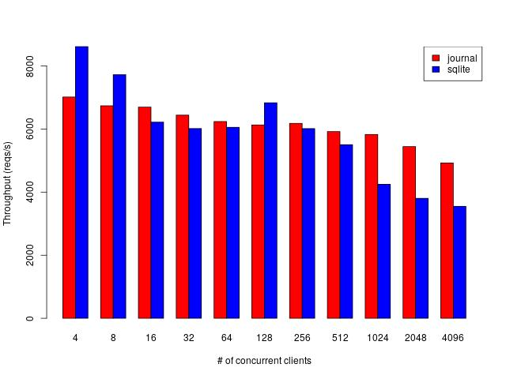

# Recap and motivation

* Distributed systems are hard

* In a previous episode, we showed how to do so called *simulation testing*
  - Run your software system in a simulated world
  - "Digital twin" in business speak
  - Analogy: wind tunnel
  - Speed up time
  - Fast and determinstic system tests

* Today we will show how to build upon these ideas to enable debuggability of live systems
  - Live as in deployed systems, not just systems running in a test environment
  - Time traveling debugger (step forward *and backwards* and see how the system
    evolves over time)
  - Analogy: black-box in a plane (journal of all events that happened from
    takeoff to crash)
  - More than merely logging, we can *replay* the exact concurrent execution of
    the system determinstically
  - Quickly diagnose problems in production
  - Verify that bug fixes work in production environments (not just test environment)

# Overview

* High-level technical idea of how we achieve conveniently debuggable distributed systems

* The design of the journal of events (our "black-box")
  - Low performance overhead
  - Also useful for efficient crash recovery

* Demo comparing our journal design vs SQLite
  - Collect performance metrics in the software under test
  - Simple benchmarking library using said metrics

* Show how rich debugging information is computed/derived from journal

# Inspiration and prior work

* Erlang
  - Perhaps best known for: lightweight threads and message passing ("everything
    is a process")
  - Deeper point stressed in Armstrong's thesis [@joe]: behaviours (better known
    as interfaces)

    + separate application code ("business logic") which is *sequential* from
      networking/communcation which is *concurrent*

* Mozilla's `rr` tool, "time traveling debugger", determinstic replay for
  concurrent executions (very low-level, syscalls)

* Event sourcing (don't necessarily allow determinstic replay, but they could)

* Write-ahead-log (WAL) in databases (atomicity and durability of transactions)

* Chuck's [Bandwagon](https://github.com/ocheret/readyposition) framework

* Martin "LMAX" Thompson et al's [Aeron](https://github.com/real-logic/aeron)

  - [Aeron: Open-source high-performance
    messaging](https://www.youtube.com/watch?v=tM4YskS94b0) (Strange Loop 2014)

  - [Cluster Consensus: when Aeron met
    Raft](https://www.youtube.com/watch?v=GFfLCGW_5-w) (GOTO 2018)

# High-level idea

* Follow Armstrong's advice:

  - Sequential business logic: state machine (function from input and state to
    output and new state)

  - Event loop which hides the concurrency associated with client requests and
    internal communcation between state machines

  - The sequential state machines run on top of the event loop, and get fed one
    event/message/input at the time (assuming the state machines are
    determinstic, the whole system will be determinstic)

* Keep a journal/write-ahead-log/event store of all events received/processed by
  the event loop, this can then be used to *replay* a concurrent execution in a
  determinstic way
  - Snapshots of the application state can be used to truncate/compact the
    journal so it doesn't grow too big

* While replaying we can dump intermediate states when stepping the state
  machines, allowing us to visualise how state machines change over time giving
  us a time traveling debugger a la `rr` but on a application-level (high-level
  application events) rather than OS-level (low-level syscalls)

* Can you imagine how all these things together *could* enable convenient
  debugging of distributed systems?

# Design of the journal

* Heavily inspired by Martin "LMAX" Thompson et al's Aeron log buffer
* Circular buffer implemented on top of `mmap`ed byte array
* Three (virtual) files (clean, active, dirty)
* `recv` zero-copied straight to byte array (and persisted)
* Lock- and wait-free concurrency

# Design of the journal

{ height=90% }

# Design of the journal

{ height=90% }

# Design of the journal

{ height=90% }

# Design of the journal

{ height=90% }

# Design of the journal

{ height=90% }

# Design of the journal

{ height=90% }

# Design of the journal

{ height=90% }

# Design of the journal

{ height=90% }

# Design of the journal

{ height=90% }

# Design of the journal

{ height=90% }

# Design of the journal

{ height=90% }

# Design of the journal

{ height=90% }

# Design of the journal

{ height=90% }

# Design of the event loop

1. Start a webserver where the request handlers have concurrent write access to
   a shared journal/channel (in the SQLite case);

2. Request handlers merely write the entire request into the journal/channel
   (this gives us a linearised sequence of requests);

3. A separate "worker" thread reads the journal/channel entires and
   updates/queries the state of the database (sequential access to db).

```

    main() {
      journalOrChannel := createJournalOrChannel()
      fork (worker journalOrChannel)
      startWebserver (requestHandler journalOrChannel)
    }
```

# Demo

* The first version uses SQLite to persist the application log, all reads and
  writes go through the database.

* The second version uses a on-disk journal which records all incoming data, and
  an in-memory application log is built from the journal. Writes are therefore
  indirectly persisted via the journal, and replaying the log lets us rebuild
  the in-memory application log in case of crashes. All reads go directly via
  the in-memory log. Snapshots of the journal can be taken and recovered from.

* The two implementations are benchmarked and compared. Metrics are collected
  via built-in profilers in both versions.

* For the journaled version we also show how it can be debugged via the snapshot
  and journal using deterministic replay to show how the state machines change
  over time (whether the server is running or not).

# Demo script

```bash
# Show Dumblog API
echo hi | http POST :8054 # Append to log, returns index, e.g. 0;

http GET :8054/0          # Read at index from log, returns string,
                          # e.g. "hi".

```

# Benchmarks

```bash
# Use the performance governor instead of powersave (for laptops).
for policy in /sys/devices/system/cpu/cpufreq/policy*; do
    echo "${policy}"
    echo "performance" | sudo tee "${policy}/scaling_governor"
done

# Disable turbo boost.
echo 1 | sudo tee /sys/devices/system/cpu/intel_pstate/no_turbo

# The following run is just a (CPU) warm up, the results are discarded.
bench-sqlite

for i in $(seq 10); do
  for j in $(seq 2 12); do
    bench-journal -- $((2**$j)) >> /tmp/bench-journal-$j.txt
    bench-sqlite  -- $((2**$j)) >> /tmp/bench-sqlite-$j.txt
  done
done
```

# Benchmark statistics

```R
Input512=("
  workload                   throughput
  journal-512                6129.90
  ...
  journal-512                5756.72
  sqlite-512                 4851.46
  ...
  sqlite-512                 6735.40
")

df512 = read.table(textConnection(Input512),header=TRUE)
bartlett.test(df512$throughput ~ df512$workload, data=df512)

t.test(df512$throughput ~ df512$workload, data=df512,
       var.equal=TRUE,
       conf.level=0.95)
```

* Output

```bash
data:  df512$throughput by df512$workload
t = 0.29646, df = 18, p-value = 0.7703
mean in group journal-512  mean in group sqlite-512
                 5937.373                  5839.218
```

# Benchmark plot



# Amdahl's law vs the Universal scalability law

* *C(N) = N / (1 + a(N - 1) + ((b \* N) \* (N - 1)))*
  + *C* = capacity or throughput
  + *N* = number of processors
  + *a* = contention penality (time under some kind of lock)
  + *b* = coherence penality (time to agree, e.g. load the cache line with the shared reference)

{ width=60% }

# Built-in profiler/metrics

* Ideas due to Tyler "sled" Neely and Thompson et al
* Brendan Gregg's [U(tilisation) S(aturation)
  E(rrors)](https://www.brendangregg.com/usemethod.html)
* (Atomic) counters (an 64-bit signed integer)
* Histograms (2 + 2^16 counters) uses `log` and `exp` for
  compression/decompression
* `mmap`ed bytearray (8 bytes per counter) allows for atomic update (`lock xadd`
  in x86 asm) and access for different processes
* No third party dependencies or extra processes that need to be deployed

{ width=70% }

# Summary

* We have shown how to use the journal to:
  - Faster write path than with a database (lock-free, append only and zero-copy)
  - Get faster crash recovery for free
  - Get all the deterministic testing stuff for free
  - Rich time traveling debugger
* How to add a built-in a profiler and how to use it in benchmarks
* Zero third-party dependency observability (metrics/logs/tracing)

# Future work

* Add ability to download remote nodes’ snapshots and journals in the debugger
  for a complete complete view of how the system as a whole changed over time
  (partial views are OK, in case not all nodes wants to give access);

* Save journal prefixes that lead up to crashes in a separate location so they
  can be debugged after the fact, even if the journal has been rotated (we don’t
  want to keep all of the journal forever due to space limitations);
  - Broken analogy: have several black-boxes, one for each crash...

* Work out all corner cases with regards to versioning of journal and snapshots,
  following Chuck's Bandwagon approach;

* Event loop integration: all the above should be implemented on at the event
  loop level so that state machines (sequential code / "business logic") running
  on top of it get all this for free.

# Even further in the future work

* The journal variant currently saves the whole bytestrings in-memory, more
  realistically one could only save keys/topics and offset/length pairs
  (pointing to disk locations) in-memory and use `sendfile` for zero-copy reads
  for the journal version of the service;

* Using the Linux kernel's `io_uring` to ammortise the cost of syscalls (by
  batching and doing them async);

* But protocol improvements are likely much more important for performance than
  these low-level database engine and event loop improvements!

# Thanks! Questions? References:
