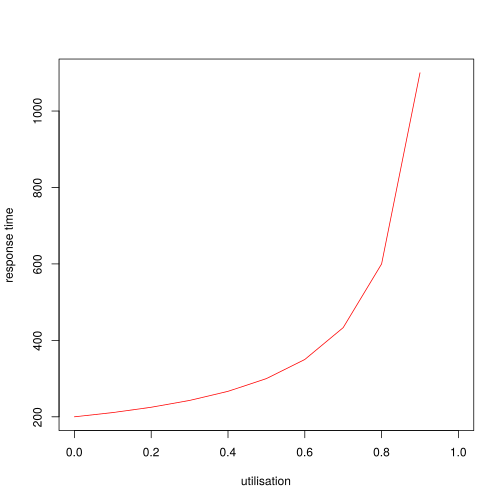
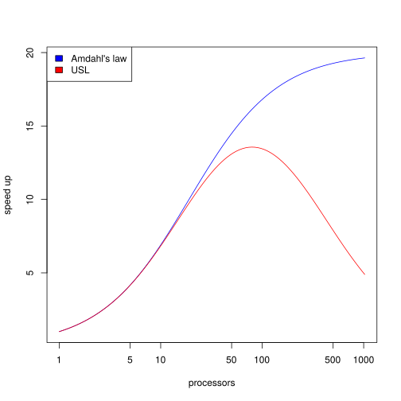

# Towards performant services

This document tries to answer the following questions:

* What do we mean by performance?
* How is it different from scalability?
* What do we need to know about our hardware in order to be able to write performat code?
* What techniques and tools are there in this space?
* How to do proper benchmarks?

## Queuing theory

  * latency: how long you have to wait (being latient) in the queue
  * service time: how long it takes to service my request once done queuing
  * response time: latency + service time
  * utilisation: the proportion of time that a system is busy

  * *r = s(2 - p) / 2(1 - p)*
      where
        *r* = mean response time,
        *s* = service time,
        *p* = utilisation.

    

  + when high utilisation the response time shoots up, because there will more
    likely be latency (service time stays the same)

  + keep utilisation low, have sufficient capacity

  + (Generate using R with: `s = 200; p <- seq(0, 1, 0.1); svg("utilisation_vs_response_time.svg"); plot(p, (s*(2-p)) / (2*(1 - p)), type="l", col="red", xlab="utilisation", ylab="response time"); dev.off()`)

  + Little's law:
    - the mean number of jobs in the system = arrival wate * mean waiting time in the system;

    - or, mean response time = mean number in system / mean throughput (aka
      bandwidth);

    - or, the average queue length equals the average arrival rate times the
      average waiting time;

    - or, average waiting time = average queue length * average time between two arrivals;

    - or, latency (mean waiting time) = concurrent connections (mean number of jobs in
      system) / throughput (arrival rate).

## Scalability

If we add resource we get propotional increase in throughput.

* universal scalability law (USL)
  + refinement of Amdahl's law

  + C(N) = N / (1 + a(N - 1) + ((b * N) * (N - 1)))
      where
        C = capacity or throughput
        N = number of processors
        a = contention penality (time under some kind of lock)
        b = coherence penality (time to agree, e.g. load the cache line with the
                                shared reference)

  + contention = 95% (of the program can be done in parallel): a = 0.05
    150 microseconds, b = 0.00015

   

  + speed up vs processors (bell curve): even if a program is highly parallel
    (95%) contention and coherence penalties will eventually make adding more
    processors to cause a slow down.

  + (Generate in R using: `N <- 2^(seq(0, 10, 0.1)); a = 0.05; b = 0.00015; C <- function(N, b) { N / ((1 + (a * (N - 1)) + (b * N * (N - 1)))) }; svg("amdahl_vs_usl.svg"); plot(N, C(N, 0), type="l", col="blue", log='x', xlab="processors", ylab="speed up"); lines(N, C(N,b), col="red"); legend("topleft", c("Amdahl's law", "USL"), fill=c("blue", "red")); dev.off()`)

## Mechanical sympathy

In order to make the most out of our hardware we must know a bit about how it
was designed. Modern CPUs make three bets: temporal locality, spatial locality
and striding.

* Temporal locality

  + if we access the same memory location over and over again with, small time
    delta, it will more likely be in the cache

* Spatial locality

  + cache lines

    - when you ask for a variable, you don't just get a byte/word you get a full
      cache line, which might contain other data elements. this might become a
      problem if you have multiple processor sharing a cache line (getting each
      others data elements when fetching cache lines)

    - typically 64 bytes, or 8 longs

    - avoid "false sharing" cache lines, as this essentially creates locks between
      processors

   + memory pages
     - OS + CPU break up RAM into pages, translation look-aside buffer (TLB)
     - TLB cache won't fit the whole mapping from virtual to physical pages

* Striding (accesses pattern repeat)
  + predicatable access begets pre-fetching
  + data structures need to be contiguous

* Modern CPU's cache hierarchy

  - single writer principle
    + if two or more cores write to same cache line then there's contention
    + if there's only a single writer (cpu core) for each cache line then the
      contention goes away

  - cache misses
    + cold / compulsory: if you never read the data before it won't be in the cache
    + capacity: things get evicted from cache as it fills up, so you might get a
      miss on something you have read before if it got evicted
    + conflict:
      - mapping: some data can be put anywhere in the cache some has specific
                 places with respect to other data, we can have misses because
                 of those mappings
      - replacement: has to do with eviction as well (!?)

* arithmetic tricks
  + avoid division as it's the most expensive operation, multiply instead, e.g.
    `x / 100` becomes `x * 0.01`

  + power of 2 to be able to replace modulos by bitwise and:
    `mod(j, 2^i) == j & (2^i - 1)`

## Techniques

* Pipelining

* Batching
  - tames the response time vs utilsation hockey curve by reducing service time
    per job, e.g. by amortising the cost to write to disk or some other
    expensive operation

* Sharding
  - avoids contention and coherence penalties by working on disjoint data, e.g.
    two processors one working on even numbers and the other on odd numbers.

* Zero-deserialisation
  - binary codecs

  - the idea is basically to instead of parsing a bytestring into a
    struct/object, which allocates memory, to refer to the fields of the struct
    by offsets in the bytestring (which we know because we know the types of the
    the fields) and cast the bytes into the appropriate types upon need
  - for more see, e.g.:
    + https://brunocalza.me/what-zero-copy-serialization-means/
    + https://rkyv.org/zero-copy-deserialization.html
    + https://scattered-thoughts.net/writing/zero-copy-deserialization-in-julia/
    + https://github.com/neuecc/ZeroFormatter#architecture

* lock-free and wait-free datastructures
  - tries to avoid contention

* Zero-copy
  - avoid allocating memory
  - don't pollute the CPU caches
  - avoid copying data from kernel space to user space and back
  - `sendfile`, `splice`, `copy_file_range` syscalls

* Zero-syscall: io_uring async and amortised (batched) disk I/O and networking syscalls

* Case study: the LMAX disruptor pattern
  - keys to disruptor's performance
    + pin to core
    + avoid locks
    + minimise usage of memory barriers
    + pre-allocate and reuse memory
    + thread control

  - what's wrong with queues
    + unbounded linked lists don't stride (cpu can't pre-fetch)
    + bounded arrays share cache lines, e.g. consider the head and tail pointers,
      if they are on the same cache line and two processors need to update them...
    + causes heavy gc: reading from a queue is actually a write operation, because
      you remove the element

  - garbage collection
    + reuse memory to prevent GC and compactation (replies on fixed size datastructures?)
    + restart every day to clear the heap

  - makes pipelining, batching and sharding easy and clear where to apply

  - how does one most efficiently fill and process the ring buffer?
    + io_uring for network producers
    + zero-copy from network socket to journal?
    + zero-deserialisation from one ring buffer to the other?
    + reply to read requests using zero-copy from file db?
    + do all this async and in batches using io_uring?

## Benchmarking

* Turbo boost: modern (Intel?) CPUs will overclock when there's work to do until
  they hit some thermal limit, this creates unpredicatable performance and hence
  should be turned off before measuring
  `echo 1 | sudo tee /sys/devices/system/cpu/intel_pstate/no_turbo

* drop caches
  - pagecache can be dropped via:
   `sync && echo 3 | sudo tee /proc/sys/vm/drop_caches`
  - system-wide memory can be compacted via:
  `echo 1 | sudo tee /proc/sys/vm/compact_memory`

* interleave benchmarks to reduce the risk of having transient system state
  impact a single measurement

* Student's t-test: can be used to test if the mean from two populations is
  really different or just appears to be due to variance

* Little's law: can be used to calculate latency from throughput and mean number
  of concurrent jobs/clients (the later can be easily calculated by keeping a
  counter which gets incremented when a new job/client arrives and decremented
  just before it finishes, the mean can be captured using a histogram to log the
  current value of the counter).

* using `perf` to measure CPU performance:
  - `perf stat --event=L1-dcache-loads,L1-dcache-load-misses,LLC-loads,LLC-load-misses,dTLB-loads,dTLB-load-misses $BENCHMARK`
  - For more see: https://brendangregg.com/perf.html

## See also

* Tyler Neely's performance [guide](https://sled.rs/perf.html)
* Anything by Brendan Gregg, e.g.: https://brendangregg.com/methodology.html
* Anything by Martin Thompson, e.g.
  - [Designing for Performance](https://youtube.com/watch?v=fDGWWpHlzvw) by
    Martin Thompson (GOTO 2015)
